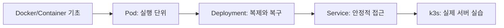

# 01. 강의 소개와 학습 경로

- 영상: [강의 소개와 학습 경로](https://www.youtube.com/watch?v=3VT7Suh9HIw)
- 플레이리스트: [JSCODE Kubernetes 입문/실전](https://www.youtube.com/playlist?list=PLtUgHNmvcs6pBvcX0ilCncJRgBHNs40vX)
- 문서 성격: 이 문서는 영상의 한국어 자막/스크립트를 확인한 뒤 재구성한 학습 문서다. 원문 스크립트를 복제하지 않고, 영상 흐름을 따라 개념 설명, 그림, 실습 코드를 보강했다.

## 이 챕터에서 얻어야 할 것

쿠버네티스 입문/실전 강의의 전체 범위와 학습 순서를 잡는다.

## 스크립트 기반 흐름 정리

- 강의가 비전공자도 따라올 수 있도록 짧은 개념 설명과 실습으로 구성된다는 점을 소개한다.
- 앞부분은 Pod를 직접 띄우며 컨테이너가 쿠버네티스 안에서 어떤 단위로 실행되는지 확인한다.
- 중반부는 Deployment와 Service를 통해 운영에 필요한 복제, 복구, 네트워크 접근 문제로 확장한다.
- 마지막은 k3s를 이용해 실제 서버 환경에 가까운 쿠버네티스 실습으로 넘어간다.

## 근원탐색: 왜 이 개념이 필요한가

컨테이너 하나를 실행하는 것과 서비스를 운영하는 것은 다르다. 서버가 여러 개가 되고 장애, 배포, 접근 경로, 확장 문제가 생기면 사람이 수동으로 관리하기 어렵다. 이 강의는 그 운영 문제를 Pod, Deployment, Service, k3s 순서로 쪼개서 보여준다.

## 구조 그림



## 핵심 개념 해설

오리엔테이션은 이후 챕터를 흩어진 개념 목록으로 보지 않게 해준다. Pod, Deployment, Service, k3s는 서로 별개가 아니라 컨테이너 운영 문제를 단계적으로 확장하는 흐름이다.

## 실습 매니페스트/코드

- 이 챕터는 개념/설치 흐름 중심이라 고정 YAML 예시는 없다. 영상 시청 중 실제 환경 값은 별도 lab 문서에 기록한다.

## 따라칠 명령어

```bash
kubectl cluster-info
```

```bash
kubectl get nodes
```

## 확인 포인트

- Pod, Deployment, Service를 각각 “실행-관리-접근” 문제와 연결해서 볼 준비를 한다.
- 영상을 보기 전 이 플레이리스트가 Docker 강의가 아니라 컨테이너 운영 강의라는 점을 기억한다.

## 영상 기반 상세 학습 노트

이 강의는 쿠버네티스 전체 사전을 한 번에 외우는 방식이 아니라, 서버를 실제로 띄우고 접근하고 업데이트하며 필요한 개념을 하나씩 끌어오는 흐름이다. Pod, Deployment, Service, k3s는 각각 실행, 관리, 접근, 실제 서버 실습의 단계로 연결된다.

### 화면/구조를 문서로 옮기면


### 실습할 때 같이 확인할 명령

```bash
kubectl version --client
kubectl config current-context
kubectl get nodes
```

### 이 장에서 꼭 남길 관찰

- 명령이 성공했는지보다 어떤 객체의 상태가 바뀌었는지 먼저 적는다.
- 실패가 나오면 `get -> describe -> logs/events` 순서로 원인을 좁힌다.
- 안정화된 설명은 나중에 `docs/concepts/`로 승격하고, 실제 실행 결과는 `docs/labs/`에 남긴다.

## 자주 헷갈리는 지점

- 리소스 이름보다 이 리소스가 해결하는 운영 문제를 먼저 기억한다.

## 다음 문서로 승격할 내용

- 실습 결과는 `docs/labs/`에 따로 남기고, 반복해서 재사용할 개념은 `docs/concepts/`로 승격한다.
