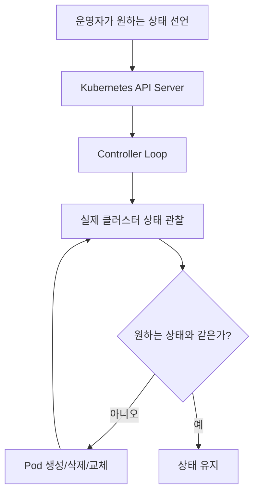
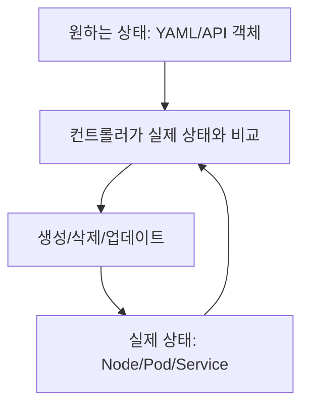

# 02. 쿠버네티스란 무엇인가

- 영상: [쿠버네티스란 무엇인가](https://www.youtube.com/watch?v=_M4oY7aK9ck)
- 플레이리스트: [JSCODE Kubernetes 입문/실전](https://www.youtube.com/playlist?list=PLtUgHNmvcs6pBvcX0ilCncJRgBHNs40vX)
- 문서 성격: 이 문서는 영상의 한국어 자막/스크립트를 확인한 뒤 재구성한 학습 문서다. 원문 스크립트를 복제하지 않고, 영상 흐름을 따라 개념 설명, 그림, 실습 코드를 보강했다.

## 이 챕터에서 얻어야 할 것

쿠버네티스를 다수의 컨테이너를 배포, 확장, 관리하는 오픈소스 오케스트레이션 시스템으로 이해한다.

## 스크립트 기반 흐름 정리

- 자막은 쿠버네티스를 여러 컨테이너를 효율적으로 배포, 확장, 관리하기 위한 시스템으로 설명한다.
- Docker에서 컨테이너를 하나 띄우는 수준을 넘어, 여러 프로그램을 여러 서버에 나누어 운영하는 상황을 전제로 둔다.
- 강의는 쿠버네티스의 장점을 자동 배포, 확장, 복구 같은 운영 자동화와 연결한다.

## 근원탐색: 왜 이 개념이 필요한가

Docker는 컨테이너 실행을 쉽게 만들었지만, 컨테이너가 많아지면 어디에 배치할지, 죽으면 어떻게 살릴지, 트래픽이 늘면 어떻게 늘릴지, 새 버전은 어떻게 바꿀지 문제가 남는다. 쿠버네티스는 이 문제를 “원하는 상태를 선언하면 컨트롤러가 실제 상태를 맞춘다”는 방식으로 푼다.

## 구조 그림




## 실습 매니페스트/코드

- 이 챕터는 개념/설치 흐름 중심이라 고정 YAML 예시는 없다. 영상 시청 중 실제 환경 값은 별도 lab 문서에 기록한다.

## 따라칠 명령어

```bash
kubectl version
```

```bash
kubectl api-resources
```

```bash
kubectl get all
```

## 확인 포인트

- 쿠버네티스를 “컨테이너 실행기”가 아니라 “컨테이너 운영 자동화 시스템”으로 설명한다.
- 원하는 상태와 실제 상태라는 두 단어로 Kubernetes 동작 방식을 요약한다.

## 영상 기반 상세 학습 노트

쿠버네티스는 컨테이너 실행 명령을 대신 치는 도구라기보다 원하는 상태를 API 서버에 저장하고 컨트롤러들이 실제 상태를 계속 맞추는 제어 시스템이다. 컨테이너가 많아지고 서버가 여러 대가 되면 배포, 복구, 확장, 업데이트를 사람이 직접 맞추기 어렵기 때문에 등장했다.

### 화면/구조를 문서로 옮기면



### 실습할 때 같이 확인할 명령

```bash
kubectl apply -f pod.yaml
kubectl get pods -o wide
kubectl describe pod <pod-name>
```

### 이 장에서 꼭 남길 관찰

- 명령이 성공했는지보다 어떤 객체의 상태가 바뀌었는지 먼저 적는다.
- 실패가 나오면 `get -> describe -> logs/events` 순서로 원인을 좁힌다.
- 안정화된 설명은 나중에 `docs/concepts/`로 승격하고, 실제 실행 결과는 `docs/labs/`에 남긴다.

## 자주 헷갈리는 지점

- 리소스 이름보다 이 리소스가 해결하는 운영 문제를 먼저 기억한다.

## 다음 문서로 승격할 내용

- 실습 결과는 `docs/labs/`에 따로 남기고, 반복해서 재사용할 개념은 `docs/concepts/`로 승격한다.
