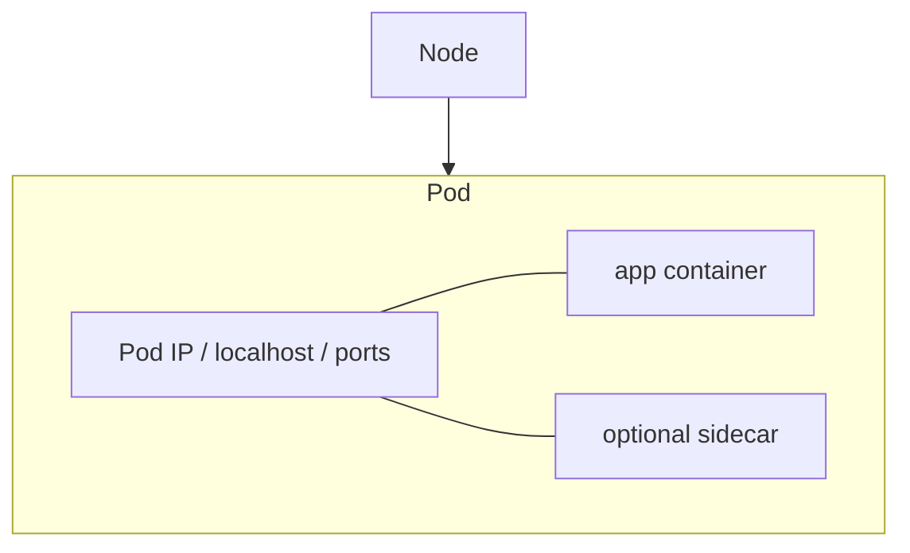
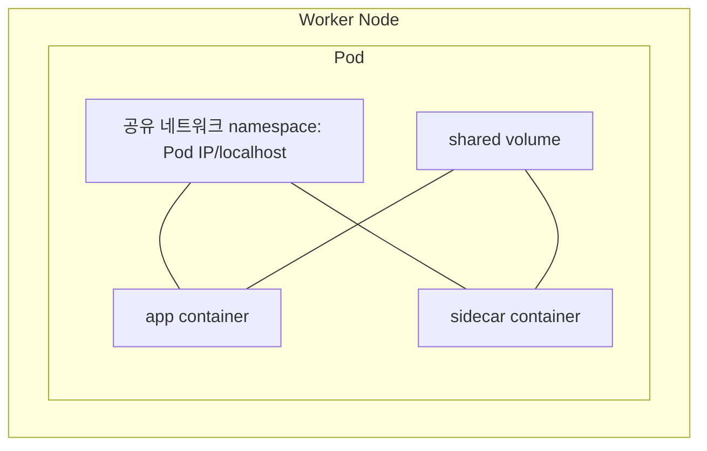

# 03. Pod란 무엇인가

- 영상: [Pod란 무엇인가](https://www.youtube.com/watch?v=UJssa3nc0FQ)
- 플레이리스트: [JSCODE Kubernetes 입문/실전](https://www.youtube.com/playlist?list=PLtUgHNmvcs6pBvcX0ilCncJRgBHNs40vX)
- 문서 성격: 이 문서는 영상의 한국어 자막/스크립트를 확인한 뒤 재구성한 학습 문서다. 원문 스크립트를 복제하지 않고, 영상 흐름을 따라 개념 설명, 그림, 실습 코드를 보강했다.

## 이 챕터에서 얻어야 할 것

Pod가 쿠버네티스에서 컨테이너를 감싸는 최소 실행 단위임을 이해한다.

## 스크립트 기반 흐름 정리

- 영상은 Pod를 컨테이너를 감싸는 쿠버네티스의 가장 작은 배포 단위로 설명한다.
- 컨테이너 하나를 바로 관리하지 않고 Pod라는 단위로 묶어 IP, 포트, 생명주기를 부여하는 관점을 제시한다.
- 일반적인 입문 실습에서는 하나의 Pod 안에 하나의 애플리케이션 컨테이너를 둔다.

## 근원탐색: 왜 이 개념이 필요한가

컨테이너만 직접 관리하면 네트워크, 볼륨, 생명주기 같은 운영 단위가 애매해진다. Kubernetes는 컨테이너를 직접 스케줄링하지 않고 Pod를 스케줄링한다. Pod는 컨테이너들이 공유할 네트워크 namespace와 실행 컨텍스트를 제공한다.

## 구조 그림




## 실습 매니페스트/코드

```yaml
apiVersion: v1
kind: Pod
metadata:
  name: nginx-pod
spec:
  containers:
    - name: nginx
      image: nginx:latest
      ports:
        - containerPort: 80
```

## 따라칠 명령어

```bash
kubectl apply -f pod.yaml
```

```bash
kubectl get pods -o wide
```

```bash
kubectl describe pod nginx-pod
```

## 확인 포인트

- Pod와 컨테이너의 관계를 “Pod가 컨테이너 실행 환경을 감싸는 단위”라고 설명한다.
- containerPort가 포트포워딩 설정이 아니라 메타데이터에 가깝다는 점을 기억한다.

## 영상 기반 상세 학습 노트

Pod는 컨테이너 하나의 별칭이 아니라 Kubernetes가 스케줄링하고 생명주기를 관리하는 최소 실행 환경이다. Pod 안 컨테이너들은 네트워크 namespace와 볼륨을 공유할 수 있고, 그래서 같은 Pod 안에서는 localhost와 포트 충돌 문제가 생긴다.

### 화면/구조를 문서로 옮기면



### 실습할 때 같이 확인할 명령

```bash
kubectl apply -f nginx-pod.yaml
kubectl get pod nginx-pod -o wide
kubectl exec -it nginx-pod -- sh
```

### 이 장에서 꼭 남길 관찰

- 명령이 성공했는지보다 어떤 객체의 상태가 바뀌었는지 먼저 적는다.
- 실패가 나오면 `get -> describe -> logs/events` 순서로 원인을 좁힌다.
- 안정화된 설명은 나중에 `docs/concepts/`로 승격하고, 실제 실행 결과는 `docs/labs/`에 남긴다.

## 자주 헷갈리는 지점

- Pod의 `containerPort`는 Docker의 `-p` 같은 포트포워딩 설정이 아니다. 실제로는 프로세스가 해당 포트를 listen해야 한다.

## 다음 문서로 승격할 내용

- `docs/concepts/pod.md`에 Pod의 실행 단위, 네트워크 namespace, containerPort 오해를 정리한다.
