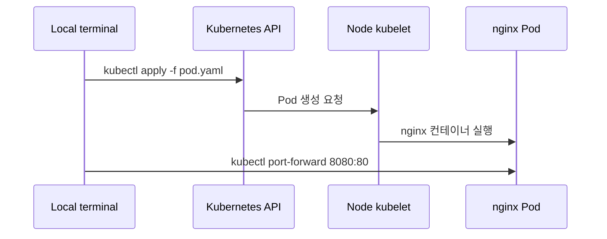
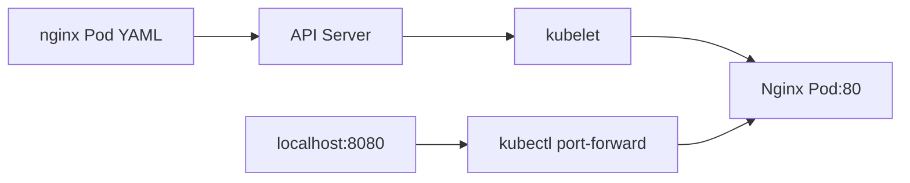

# 04. Nginx 웹 서버를 Pod로 실행하기

- 영상: [Nginx 웹 서버를 Pod로 실행하기](https://www.youtube.com/watch?v=sUUWAOzib8M)
- 플레이리스트: [JSCODE Kubernetes 입문/실전](https://www.youtube.com/playlist?list=PLtUgHNmvcs6pBvcX0ilCncJRgBHNs40vX)
- 문서 성격: 이 문서는 영상의 한국어 자막/스크립트를 확인한 뒤 재구성한 학습 문서다. 원문 스크립트를 복제하지 않고, 영상 흐름을 따라 개념 설명, 그림, 실습 코드를 보강했다.

## 이 챕터에서 얻어야 할 것

Nginx 컨테이너 이미지를 Pod로 실행하고 kubectl 기본 흐름을 익힌다.

## 스크립트 기반 흐름 정리

- 영상은 YAML 매니페스트로 Nginx Pod를 만들고 클러스터에 적용하는 흐름을 보여준다.
- Pod 생성 후 kubectl로 상태를 확인하고, 상세 정보에서 이미지, 포트, 이벤트를 확인한다.
- 로컬에서 접근하려면 port-forward를 사용해 내 컴퓨터 포트를 Pod 포트에 임시 연결한다.

## 근원탐색: 왜 이 개념이 필요한가

Docker에서는 컨테이너를 직접 실행했지만 Kubernetes에서는 Pod 매니페스트를 API 서버에 제출한다. 이 차이는 “명령으로 실행”에서 “원하는 리소스 상태를 선언”하는 방식으로 넘어가는 첫 지점이다.

## 구조 그림



## 핵심 개념 해설

실습의 중심은 YAML을 외우는 것이 아니라 “이미지로 포장된 애플리케이션을 Pod라는 실행 단위로 올리고, 상태를 관찰하고, 임시 접근 경로로 검증한다”는 반복 패턴이다. 여기서 익힌 apply/get/describe/logs/port-forward 흐름이 이후 모든 리소스 학습의 기본 루틴이 된다.

## 실습 매니페스트/코드

```yaml
apiVersion: v1
kind: Pod
metadata:
  name: nginx-pod
  labels:
    app: nginx
spec:
  containers:
    - name: nginx
      image: nginx:latest
      ports:
        - containerPort: 80
```

## 따라칠 명령어

```bash
kubectl apply -f nginx-pod.yaml
```

```bash
kubectl get pods
```

```bash
kubectl describe pod nginx-pod
```

```bash
kubectl port-forward pod/nginx-pod 8080:80
```

```bash
curl http://localhost:8080
```

```bash
kubectl delete pod nginx-pod
```

## 확인 포인트

- apply/get/describe/port-forward/delete 흐름을 손으로 반복한다.
- localhost:8080이 Pod의 80번 포트에 임시 연결되는 구조를 그림으로 설명한다.

## 영상 기반 상세 학습 노트

Nginx 예제는 Kubernetes의 가장 작은 실습 루프다. YAML을 API 서버에 등록하고, Pod가 어느 노드에 떴는지 보고, 로컬 확인을 위해 port-forward를 열고, 마지막에 파일 기준으로 삭제한다.

### 화면/구조를 문서로 옮기면



### 실습할 때 같이 확인할 명령

```bash
kubectl apply -f nginx-pod.yaml
kubectl get pods -o wide
kubectl port-forward pod/nginx-pod 8080:80
curl http://localhost:8080
kubectl delete -f nginx-pod.yaml
```

### 이 장에서 꼭 남길 관찰

- 명령이 성공했는지보다 어떤 객체의 상태가 바뀌었는지 먼저 적는다.
- 실패가 나오면 `get -> describe -> logs/events` 순서로 원인을 좁힌다.
- 안정화된 설명은 나중에 `docs/concepts/`로 승격하고, 실제 실행 결과는 `docs/labs/`에 남긴다.

## 자주 헷갈리는 지점

- Pod의 `containerPort`는 Docker의 `-p` 같은 포트포워딩 설정이 아니다. 실제로는 프로세스가 해당 포트를 listen해야 한다.
- 영상의 이미지 이름과 포트는 실습 코드에 맞게 바뀔 수 있다. 실제로 따라칠 때는 Dockerfile과 애플리케이션 listen port를 먼저 확인한다.

## 다음 문서로 승격할 내용

- `docs/concepts/pod.md`에 Pod의 실행 단위, 네트워크 namespace, containerPort 오해를 정리한다.
