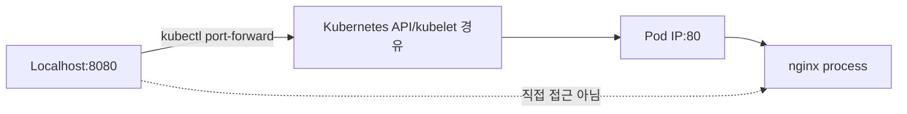
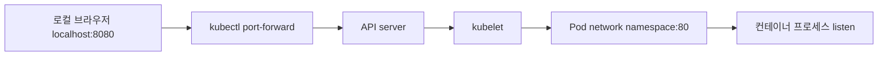

# 05. Pod로 띄운 프로그램에 바로 접속할 수 없는 이유

- 영상: [Pod로 띄운 프로그램에 바로 접속할 수 없는 이유](https://www.youtube.com/watch?v=tX7WTFtrI3Q)
- 플레이리스트: [JSCODE Kubernetes 입문/실전](https://www.youtube.com/playlist?list=PLtUgHNmvcs6pBvcX0ilCncJRgBHNs40vX)
- 문서 성격: 이 문서는 영상의 한국어 자막/스크립트를 확인한 뒤 재구성한 학습 문서다. 원문 스크립트를 복제하지 않고, 영상 흐름을 따라 개념 설명, 그림, 실습 코드를 보강했다.

## 이 챕터에서 얻어야 할 것

Pod 실행과 외부 접근은 별개의 문제이며, Pod IP는 기본적으로 클러스터 내부 주소임을 이해한다.

## 스크립트 기반 흐름 정리

- 영상은 Pod가 Running이어도 브라우저에서 바로 접근되지 않는 상황을 다룬다.
- Pod는 클러스터 내부 네트워크에 IP를 갖고, 로컬 PC의 localhost와 같은 네트워크 공간이 아니다.
- port-forward는 학습/디버깅용으로 로컬 포트와 Pod 포트를 임시 연결한다.

## 근원탐색: 왜 이 개념이 필요한가

애플리케이션 프로세스가 실행되는 것과 네트워크에 노출되는 것은 다른 문제다. Kubernetes는 실행 단위(Pod)와 접근 단위(Service, Ingress, port-forward)를 분리한다. 이 분리는 운영 환경에서 접근 제어와 라우팅을 명확히 하기 위해 필요하다.

## 구조 그림



## 핵심 개념 해설

네트워크 챕터는 “프로세스가 떴다”와 “외부에서 접근 가능하다”를 분리하는 것이 핵심이다. Pod IP, Service IP, localhost, NodePort는 서로 다른 범위의 주소다. Kubernetes는 이 경계를 명확히 나누어 운영자가 노출 범위를 선택하게 한다.

## 실습 매니페스트/코드

```yaml
apiVersion: v1
kind: Pod
metadata:
  name: web
spec:
  containers:
    - name: web
      image: nginx
      ports:
        - containerPort: 80
```

## 따라칠 명령어

```bash
kubectl get pod web -o wide
```

```bash
curl http://<pod-ip>:80
```

```bash
kubectl port-forward pod/web 8080:80
```

```bash
curl http://localhost:8080
```

## 확인 포인트

- Pod IP, localhost, Service IP가 서로 다른 네트워크 의미를 가진다는 점을 구분한다.
- port-forward는 운영 노출 방식이 아니라 임시 터널이라는 점을 정리한다.

## 영상 기반 상세 학습 노트

Pod가 Running이라는 사실과 내 로컬 브라우저에서 접근 가능하다는 사실은 다르다. Pod IP는 클러스터 내부 네트워크의 주소이고, 로컬 컴퓨터는 그 네트워크 안에 없기 때문에 개발 확인용 임시 통로로 port-forward를 사용한다.

### 화면/구조를 문서로 옮기면



### 실습할 때 같이 확인할 명령

```bash
kubectl get pod nginx-pod -o wide
kubectl port-forward pod/nginx-pod 8080:80
curl http://localhost:8080
kubectl exec -it nginx-pod -- sh -c "hostname -i"
```

### 이 장에서 꼭 남길 관찰

- 명령이 성공했는지보다 어떤 객체의 상태가 바뀌었는지 먼저 적는다.
- 실패가 나오면 `get -> describe -> logs/events` 순서로 원인을 좁힌다.
- 안정화된 설명은 나중에 `docs/concepts/`로 승격하고, 실제 실행 결과는 `docs/labs/`에 남긴다.

## 자주 헷갈리는 지점

- Pod의 `containerPort`는 Docker의 `-p` 같은 포트포워딩 설정이 아니다. 실제로는 프로세스가 해당 포트를 listen해야 한다.

## 다음 문서로 승격할 내용

- `docs/concepts/pod.md`에 Pod의 실행 단위, 네트워크 namespace, containerPort 오해를 정리한다.
