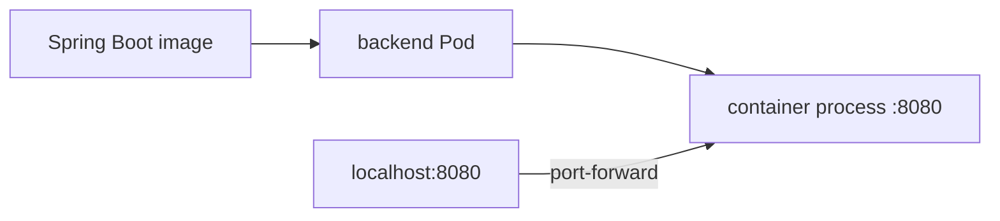
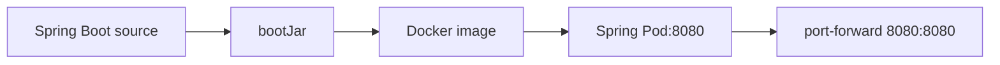

# 06. Spring Boot 백엔드를 Pod로 배포하기

- 영상: [Spring Boot 백엔드를 Pod로 배포하기](https://www.youtube.com/watch?v=P46VBBZ6Ldo)
- 플레이리스트: [JSCODE Kubernetes 입문/실전](https://www.youtube.com/playlist?list=PLtUgHNmvcs6pBvcX0ilCncJRgBHNs40vX)
- 문서 성격: 이 문서는 영상의 한국어 자막/스크립트를 확인한 뒤 재구성한 학습 문서다. 원문 스크립트를 복제하지 않고, 영상 흐름을 따라 개념 설명, 그림, 실습 코드를 보강했다.

## 이 챕터에서 얻어야 할 것

Spring Boot 애플리케이션도 컨테이너 이미지가 있으면 Pod로 동일하게 실행할 수 있음을 확인한다.

## 스크립트 기반 흐름 정리

- 영상은 Nginx 대신 Spring Boot 서버 이미지를 Pod로 띄우는 실습 흐름을 보여준다.
- 프레임워크가 바뀌어도 Kubernetes 매니페스트의 핵심은 image, port, metadata다.
- Pod 상태와 로그를 확인하고 port-forward로 HTTP 응답을 검증한다.

## 근원탐색: 왜 이 개념이 필요한가

운영자는 Java 애플리케이션인지 Node 애플리케이션인지보다, 어떤 이미지가 어떤 포트로 서비스되는지가 더 중요하다. 컨테이너 이미지는 런타임 차이를 숨기고 Kubernetes는 Pod라는 공통 실행 단위로 다룬다.

## 구조 그림



## 핵심 개념 해설

실습의 중심은 YAML을 외우는 것이 아니라 “이미지로 포장된 애플리케이션을 Pod라는 실행 단위로 올리고, 상태를 관찰하고, 임시 접근 경로로 검증한다”는 반복 패턴이다. 여기서 익힌 apply/get/describe/logs/port-forward 흐름이 이후 모든 리소스 학습의 기본 루틴이 된다.

## 실습 매니페스트/코드

```yaml
apiVersion: v1
kind: Pod
metadata:
  name: spring-backend
  labels:
    app: spring-backend
spec:
  containers:
    - name: app
      image: your-registry/spring-backend:latest
      ports:
        - containerPort: 8080
```

## 따라칠 명령어

```bash
kubectl apply -f spring-backend-pod.yaml
```

```bash
kubectl logs pod/spring-backend
```

```bash
kubectl port-forward pod/spring-backend 8080:8080
```

```bash
curl http://localhost:8080
```

## 확인 포인트

- 애플리케이션 타입이 바뀌어도 Pod 배포 패턴이 그대로인지 확인한다.
- 로그 확인과 포트 확인을 배포 검증의 기본 절차로 둔다.

## 영상 기반 상세 학습 노트

Spring Boot도 Kubernetes 입장에서는 컨테이너 이미지다. 중요한 것은 Java 프레임워크 자체가 아니라 이미지 태그, 애플리케이션 listen 포트, Pod의 containerPort, port-forward 대상 포트가 서로 맞는지 확인하는 것이다.

### 화면/구조를 문서로 옮기면



### 실습할 때 같이 확인할 명령

```bash
./gradlew bootJar
docker build -t your-registry/spring-api:0.1.0 .
kubectl apply -f spring-pod.yaml
kubectl logs -f spring-pod
kubectl port-forward pod/spring-pod 8080:8080
```

### 이 장에서 꼭 남길 관찰

- 명령이 성공했는지보다 어떤 객체의 상태가 바뀌었는지 먼저 적는다.
- 실패가 나오면 `get -> describe -> logs/events` 순서로 원인을 좁힌다.
- 안정화된 설명은 나중에 `docs/concepts/`로 승격하고, 실제 실행 결과는 `docs/labs/`에 남긴다.

## 자주 헷갈리는 지점

- Pod의 `containerPort`는 Docker의 `-p` 같은 포트포워딩 설정이 아니다. 실제로는 프로세스가 해당 포트를 listen해야 한다.
- 영상의 이미지 이름과 포트는 실습 코드에 맞게 바뀔 수 있다. 실제로 따라칠 때는 Dockerfile과 애플리케이션 listen port를 먼저 확인한다.

## 다음 문서로 승격할 내용

- `docs/concepts/pod.md`에 Pod의 실행 단위, 네트워크 namespace, containerPort 오해를 정리한다.
