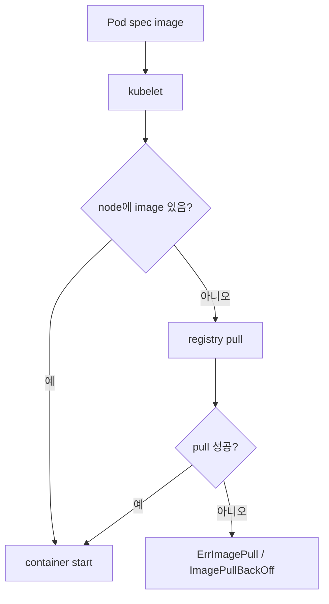
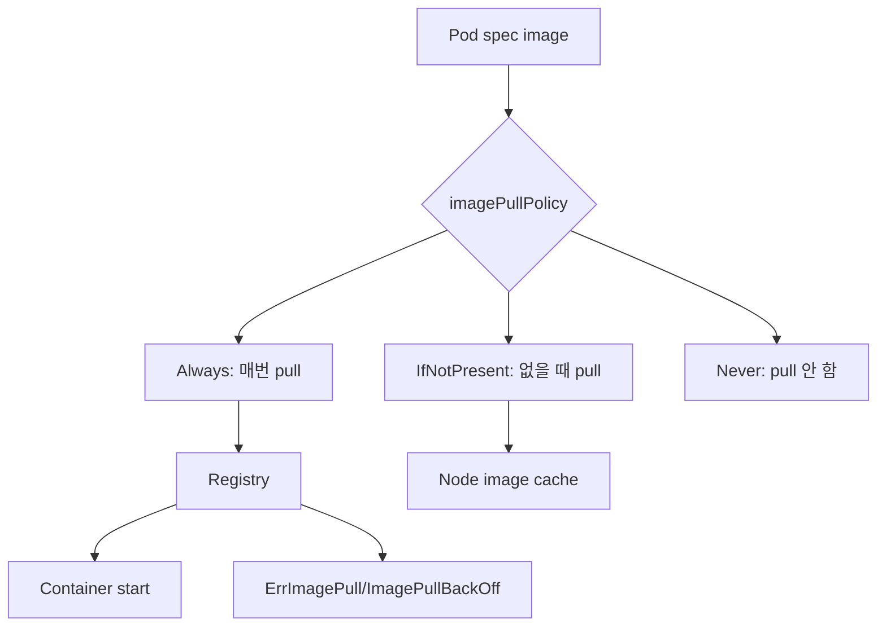

# 07. 이미지 풀 정책과 이미지 없음 오류

- 영상: [이미지 풀 정책과 이미지 없음 오류](https://www.youtube.com/watch?v=tkdDEMGl0tQ)
- 플레이리스트: [JSCODE Kubernetes 입문/실전](https://www.youtube.com/playlist?list=PLtUgHNmvcs6pBvcX0ilCncJRgBHNs40vX)
- 문서 성격: 이 문서는 영상의 한국어 자막/스크립트를 확인한 뒤 재구성한 학습 문서다. 원문 스크립트를 복제하지 않고, 영상 흐름을 따라 개념 설명, 그림, 실습 코드를 보강했다.

## 이 챕터에서 얻어야 할 것

ImagePullBackOff, ErrImagePull, imagePullPolicy가 왜 발생하는지 이해한다.

## 스크립트 기반 흐름 정리

- 영상은 이미지가 없다고 뜨는 오류를 통해 Kubernetes가 이미지를 어디서 가져오는지 설명한다.
- 이미지 이름, 태그, 레지스트리 접근 가능 여부, imagePullPolicy가 Pod 실행 성공에 영향을 준다.
- 로컬 Docker에 이미지가 있어도 클러스터 노드가 그 이미지를 볼 수 있는지는 별개의 문제다.

## 근원탐색: 왜 이 개념이 필요한가

컨테이너는 이미지가 있어야 실행된다. Kubernetes는 각 노드의 컨테이너 런타임에게 이미지를 가져오라고 지시한다. 이미지가 노드에 없거나 레지스트리에서 받을 수 없으면 애플리케이션 코드가 실행되기 전에 배포가 실패한다.

## 구조 그림



## 핵심 개념 해설

디버깅 챕터는 명령어 나열로 끝내면 안 된다. 먼저 상태를 보고, 이벤트를 보고, 그 다음 애플리케이션 로그를 본다. 이미지 pull 문제인지, 스케줄링 문제인지, 프로세스 crash인지에 따라 봐야 할 위치가 달라진다.

## 실습 매니페스트/코드

```yaml
apiVersion: v1
kind: Pod
metadata:
  name: image-policy-demo
spec:
  containers:
    - name: app
      image: your-registry/app:latest
      imagePullPolicy: IfNotPresent
```

## 따라칠 명령어

```bash
kubectl get pods
```

```bash
kubectl describe pod image-policy-demo
```

```bash
kubectl get events --sort-by=.lastTimestamp
```

```bash
docker images
```

## 확인 포인트

- 로컬 Docker 이미지와 Kubernetes 노드 이미지 캐시를 구분한다.
- latest 태그와 imagePullPolicy의 조합이 예측 가능한 배포에 불리할 수 있음을 기억한다.

## 영상 기반 상세 학습 노트

이미지 관련 오류는 “내 컴퓨터에 이미지가 있음”과 “클러스터 노드가 이미지를 실행할 수 있음”이 다르기 때문에 자주 발생한다. imagePullPolicy는 노드가 이미지를 언제 가져올지 결정하고, 실패 원인은 describe의 Events에 가장 잘 드러난다.

### 화면/구조를 문서로 옮기면



### 실습할 때 같이 확인할 명령

```bash
kubectl apply -f image-policy-demo.yaml
kubectl get pods
kubectl describe pod image-policy-demo
kubectl get events --sort-by=.lastTimestamp
```

### 이 장에서 꼭 남길 관찰

- 명령이 성공했는지보다 어떤 객체의 상태가 바뀌었는지 먼저 적는다.
- 실패가 나오면 `get -> describe -> logs/events` 순서로 원인을 좁힌다.
- 안정화된 설명은 나중에 `docs/concepts/`로 승격하고, 실제 실행 결과는 `docs/labs/`에 남긴다.

## 자주 헷갈리는 지점

- 리소스 이름보다 이 리소스가 해결하는 운영 문제를 먼저 기억한다.

## 다음 문서로 승격할 내용

- 실습 결과는 `docs/labs/`에 따로 남기고, 반복해서 재사용할 개념은 `docs/concepts/`로 승격한다.
