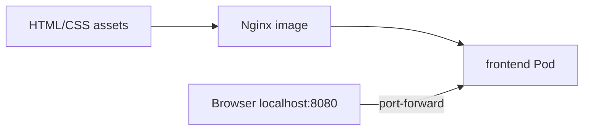
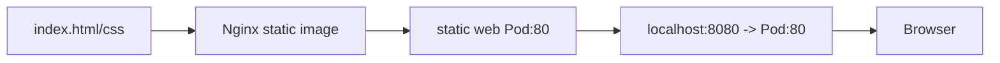

# 09. 정적 프론트엔드를 Pod로 실행하기

- 영상: [정적 프론트엔드를 Pod로 실행하기](https://www.youtube.com/watch?v=j-qy7tpTUo0)
- 플레이리스트: [JSCODE Kubernetes 입문/실전](https://www.youtube.com/playlist?list=PLtUgHNmvcs6pBvcX0ilCncJRgBHNs40vX)
- 문서 성격: 이 문서는 영상의 한국어 자막/스크립트를 확인한 뒤 재구성한 학습 문서다. 원문 스크립트를 복제하지 않고, 영상 흐름을 따라 개념 설명, 그림, 실습 코드를 보강했다.

## 이 챕터에서 얻어야 할 것

HTML/CSS 정적 파일을 Nginx 이미지로 서빙하는 프론트엔드 Pod 패턴을 이해한다.

## 스크립트 기반 흐름 정리

- 영상은 HTML/CSS 정적 프론트엔드를 Nginx 기반 이미지로 만든 뒤 Pod로 실행한다.
- 프론트엔드도 결국 HTTP 서버 컨테이너로 동작하며, Kubernetes 입장에서는 다른 Pod와 동일하다.
- port-forward로 브라우저에서 화면을 확인하는 흐름으로 실습한다.

## 근원탐색: 왜 이 개념이 필요한가

프론트엔드 배포는 파일을 서버에 복사하는 작업처럼 보이지만, 컨테이너 환경에서는 정적 파일과 웹 서버 설정을 이미지로 패키징한다. Kubernetes는 이 이미지를 Pod로 실행해 동일한 운영 모델에 올린다.

## 구조 그림



## 핵심 개념 해설

실습의 중심은 YAML을 외우는 것이 아니라 “이미지로 포장된 애플리케이션을 Pod라는 실행 단위로 올리고, 상태를 관찰하고, 임시 접근 경로로 검증한다”는 반복 패턴이다. 여기서 익힌 apply/get/describe/logs/port-forward 흐름이 이후 모든 리소스 학습의 기본 루틴이 된다.

## 실습 매니페스트/코드

```yaml
apiVersion: v1
kind: Pod
metadata:
  name: static-frontend
  labels:
    app: static-frontend
spec:
  containers:
    - name: nginx
      image: your-registry/static-frontend:latest
      ports:
        - containerPort: 80
```

## 따라칠 명령어

```bash
kubectl apply -f static-frontend-pod.yaml
```

```bash
kubectl port-forward pod/static-frontend 8080:80
```

```bash
open http://localhost:8080
```

## 확인 포인트

- 정적 프론트엔드와 백엔드 서버 모두 HTTP 프로세스를 Pod로 실행한다는 공통점을 잡는다.
- 이미지 빌드 단계에서 정적 파일이 Nginx serving directory에 들어가는지 확인한다.

## 영상 기반 상세 학습 노트

HTML/CSS 정적 프론트엔드는 빌드 산출물을 Nginx가 서빙하는 구조다. 백엔드 Pod와 마찬가지로 Kubernetes는 이미지를 실행할 뿐이고, 정적 파일이 이미지 안의 올바른 경로에 들어갔는지는 Dockerfile과 컨테이너 내부 파일로 확인한다.

### 화면/구조를 문서로 옮기면



### 실습할 때 같이 확인할 명령

```bash
docker build -t your-registry/static-web:0.1.0 .
kubectl apply -f static-web-pod.yaml
kubectl port-forward pod/static-web-pod 8080:80
curl http://localhost:8080
```

### 이 장에서 꼭 남길 관찰

- 명령이 성공했는지보다 어떤 객체의 상태가 바뀌었는지 먼저 적는다.
- 실패가 나오면 `get -> describe -> logs/events` 순서로 원인을 좁힌다.
- 안정화된 설명은 나중에 `docs/concepts/`로 승격하고, 실제 실행 결과는 `docs/labs/`에 남긴다.

## 자주 헷갈리는 지점

- Pod의 `containerPort`는 Docker의 `-p` 같은 포트포워딩 설정이 아니다. 실제로는 프로세스가 해당 포트를 listen해야 한다.
- 영상의 이미지 이름과 포트는 실습 코드에 맞게 바뀔 수 있다. 실제로 따라칠 때는 Dockerfile과 애플리케이션 listen port를 먼저 확인한다.

## 다음 문서로 승격할 내용

- `docs/concepts/pod.md`에 Pod의 실행 단위, 네트워크 namespace, containerPort 오해를 정리한다.
