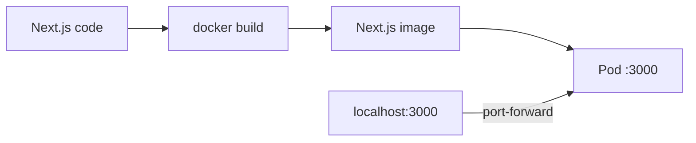
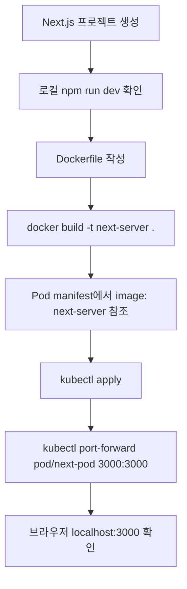
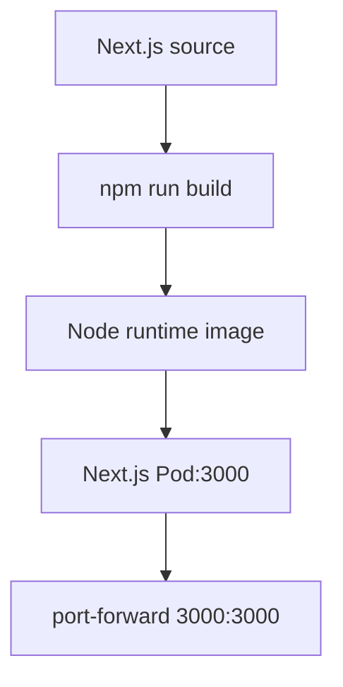

# 10. Next.js 프론트엔드를 Pod로 실행하기

- 영상: [Next.js 프론트엔드를 Pod로 실행하기](https://www.youtube.com/watch?v=vZbjjFNzeJ0)
- 플레이리스트: [JSCODE Kubernetes 입문/실전](https://www.youtube.com/playlist?list=PLtUgHNmvcs6pBvcX0ilCncJRgBHNs40vX)
- 문서 성격: 이 문서는 영상의 한국어 자막/스크립트를 확인한 뒤 재구성한 학습 문서다. 원문 스크립트를 복제하지 않고, 영상 흐름을 따라 개념 설명, 그림, 실습 코드를 보강했다.

## 이 챕터에서 얻어야 할 것

Next.js처럼 서버 런타임이 있는 프론트엔드를 Pod로 배포하는 감각을 잡는다.

## 스크립트 기반 흐름 정리

- 영상은 정적 Nginx 프론트엔드와 달리 Node 런타임을 가진 Next.js 앱을 Pod로 실행한다.
- 컨테이너 안에서 Next.js 서버 프로세스가 떠 있고, Pod 포트로 접근한다.
- 동일하게 logs와 port-forward로 실행 상태를 검증한다.

## 근원탐색: 왜 이 개념이 필요한가

프론트엔드라고 모두 정적 파일만 있는 것은 아니다. 서버 사이드 렌더링이나 API route를 쓰는 프레임워크는 서버 프로세스로 실행된다. 컨테이너 이미지는 이 실행 차이를 포장하고, Pod는 공통 운영 단위가 된다.

## 구조 그림



## 핵심 개념 해설

실습의 중심은 YAML을 외우는 것이 아니라 “이미지로 포장된 애플리케이션을 Pod라는 실행 단위로 올리고, 상태를 관찰하고, 임시 접근 경로로 검증한다”는 반복 패턴이다. 여기서 익힌 apply/get/describe/logs/port-forward 흐름이 이후 모든 리소스 학습의 기본 루틴이 된다.

## 실습 매니페스트/코드

```yaml
apiVersion: v1
kind: Pod
metadata:
  name: next-frontend
  labels:
    app: next-frontend
spec:
  containers:
    - name: app
      image: your-registry/next-frontend:latest
      ports:
        - containerPort: 3000
```

## 따라칠 명령어

```bash
kubectl apply -f next-frontend-pod.yaml
```

```bash
kubectl logs -f pod/next-frontend
```

```bash
kubectl port-forward pod/next-frontend 3000:3000
```

## 확인 포인트

- 정적 프론트엔드와 서버형 프론트엔드의 차이를 “프로세스가 계속 떠 있는가”로 구분한다.
- 앱이 0.0.0.0으로 listen하는지 확인한다. localhost에만 bind하면 컨테이너 외부 접근이 막힐 수 있다.

## 강의 포인트 확장: 영상 흐름대로 다시 쓰기

이 강의는 “프론트엔드는 정적 파일만 배포하면 된다”는 단순한 관점을 깨고, Next.js처럼 서버 런타임이 필요한 프론트엔드를 Pod로 실행하는 흐름을 보여준다. 먼저 `npx create-next-app`으로 프로젝트를 만들고, 로컬에서 `npm run dev`로 3000번 포트 응답을 확인한다. 이 검증은 Kubernetes 이전 단계다. 애플리케이션 자체가 정상 실행되지 않으면 Pod로 올려도 문제 원인을 분리하기 어렵다.

그다음 Dockerfile을 작성해 Node 런타임, 의존성 설치, 빌드, 실행 명령을 이미지 안에 넣는다. 핵심은 “Pod는 소스코드를 실행하는 것이 아니라 이미지를 실행한다”는 점이다.

```dockerfile
FROM node:20

WORKDIR /app

COPY package*.json ./
RUN npm install

COPY . .
RUN npm run build

EXPOSE 3000
ENTRYPOINT ["npm", "run", "start"]
```

```dockerignore
node_modules
.next
npm-debug.log
Dockerfile
.dockerignore
```

로컬 이미지 빌드:

```bash
docker build -t next-server .
docker image ls
```

Pod manifest 초안:

```yaml
apiVersion: v1
kind: Pod
metadata:
  name: next-pod
spec:
  containers:
    - name: next-container
      image: next-server
      imagePullPolicy: IfNotPresent
      ports:
        - containerPort: 3000
```

추천 다이어그램:



실습 명령어:

```bash
kubectl apply -f next-pod.yaml
kubectl get pods
kubectl logs next-pod
kubectl port-forward pod/next-pod 3000:3000
kubectl delete pod next-pod
```

문서에 반드시 남길 포인트:

- Next.js는 Node.js 서버 프로세스가 필요할 수 있다.
- Kubernetes는 프론트엔드/백엔드를 구분하지 않고 이미지를 실행한다.
- `containerPort: 3000`은 포트포워딩 설정이 아니다.
- 로컬 브라우저 접근은 `kubectl port-forward`가 임시 통로를 만들기 때문에 가능하다.

## 영상 기반 상세 학습 노트

Next.js는 정적 파일만 배포하는 경우와 Node 서버가 필요한 경우를 구분해야 한다. 서버 모드에서는 Nginx 정적 파일 배포가 아니라 Node 런타임 이미지가 필요하고, 일반 백엔드처럼 로그와 3000 포트를 확인한다.

### 화면/구조를 문서로 옮기면



### 실습할 때 같이 확인할 명령

```bash
docker build -t your-registry/next-web:0.1.0 .
kubectl apply -f next-pod.yaml
kubectl logs -f next-pod
kubectl port-forward pod/next-pod 3000:3000
```

### 이 장에서 꼭 남길 관찰

- 명령이 성공했는지보다 어떤 객체의 상태가 바뀌었는지 먼저 적는다.
- 실패가 나오면 `get -> describe -> logs/events` 순서로 원인을 좁힌다.
- 안정화된 설명은 나중에 `docs/concepts/`로 승격하고, 실제 실행 결과는 `docs/labs/`에 남긴다.

## 자주 헷갈리는 지점

- Pod의 `containerPort`는 Docker의 `-p` 같은 포트포워딩 설정이 아니다. 실제로는 프로세스가 해당 포트를 listen해야 한다.
- 영상의 이미지 이름과 포트는 실습 코드에 맞게 바뀔 수 있다. 실제로 따라칠 때는 Dockerfile과 애플리케이션 listen port를 먼저 확인한다.

## 다음 문서로 승격할 내용

- `docs/concepts/pod.md`에 Pod의 실행 단위, 네트워크 namespace, containerPort 오해를 정리한다.
