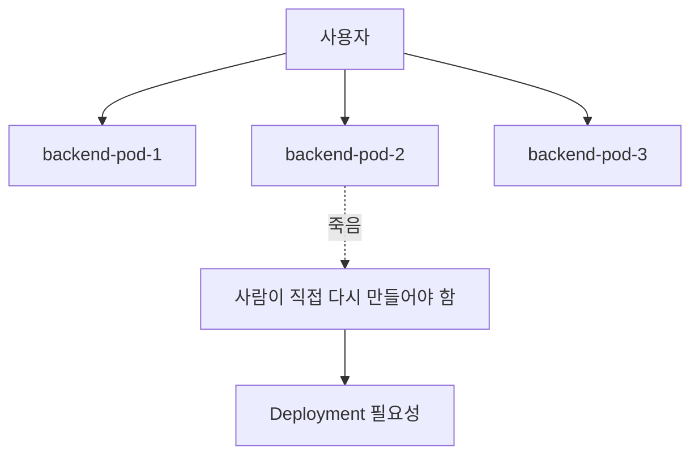
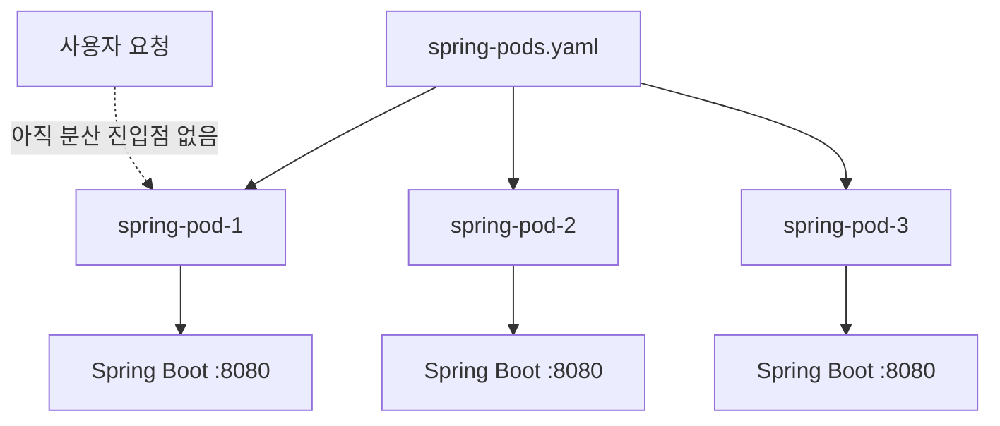
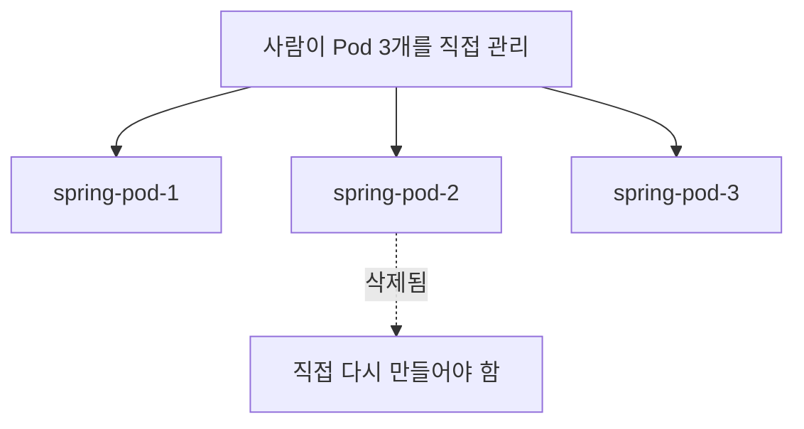

# 11. Spring Boot 서버 3개를 Pod로 직접 띄워보기

- 영상: [Spring Boot 서버 3개를 Pod로 직접 띄워보기](https://www.youtube.com/watch?v=kzsEIZ3bIvc)
- 플레이리스트: [JSCODE Kubernetes 입문/실전](https://www.youtube.com/playlist?list=PLtUgHNmvcs6pBvcX0ilCncJRgBHNs40vX)
- 문서 성격: 이 문서는 영상의 한국어 자막/스크립트를 확인한 뒤 재구성한 학습 문서다. 원문 스크립트를 복제하지 않고, 영상 흐름을 따라 개념 설명, 그림, 실습 코드를 보강했다.

## 이 챕터에서 얻어야 할 것

Pod를 직접 여러 개 만드는 방식의 한계를 체감하고 Deployment 필요성으로 연결한다.

## 스크립트 기반 흐름 정리

- 영상은 Spring Boot 서버 Pod를 3개 띄우는 상황을 다룬다.
- 수동으로 Pod를 여러 개 만들면 이름, 개수 유지, 삭제, 장애 대응을 사람이 직접 관리해야 한다.
- 이 불편함은 Deployment가 왜 필요한지 설명하는 발판이 된다.

## 근원탐색: 왜 이 개념이 필요한가

운영에서 서버를 여러 개 띄우는 일은 흔하다. 그러나 Pod를 직접 여러 개 관리하면 “항상 3개 떠 있어야 한다”는 의도를 시스템에 맡길 수 없다. Kubernetes의 강점은 개별 Pod 생성이 아니라 원하는 상태를 유지하는 컨트롤러에 있다.

## 구조 그림



## 핵심 개념 해설

이 챕터는 일부러 불편한 방식을 보여주는 성격이 강하다. Pod를 직접 여러 개 만들면 개수 유지, 이름 관리, 장애 복구가 모두 사람의 일이 된다. 이 불편함을 느껴야 Deployment가 왜 필요한지 자연스럽게 이해된다.

## 실습 매니페스트/코드

```yaml
apiVersion: v1
kind: Pod
metadata:
  name: spring-backend-1
  labels:
    app: spring-backend
spec:
  containers:
    - name: app
      image: your-registry/spring-backend:latest
      ports:
        - containerPort: 8080
```

## 따라칠 명령어

```bash
kubectl apply -f pod-1.yaml
```

```bash
kubectl apply -f pod-2.yaml
```

```bash
kubectl apply -f pod-3.yaml
```

```bash
kubectl get pods -l app=spring-backend
```

## 확인 포인트

- Pod를 직접 3개 만드는 것이 왜 선언적 운영이 아닌지 설명한다.
- “replicas: 3”이라는 추상화가 왜 필요한지 다음 챕터와 연결한다.

## 강의 포인트 확장: 수동 Pod 3개가 드러내는 문제

영상의 핵심은 Spring Boot 서버를 세 개 띄우는 데 성공하는 것이 아니라, 그 과정이 왜 불편한지를 체감하는 데 있다. 트래픽이 늘어나면 같은 서버 인스턴스를 여러 개 띄우는 수평 확장이 필요해진다. 하지만 Pod를 직접 복사하는 방식은 확장 모델이 아니라 반복 작업이다.

```yaml
apiVersion: v1
kind: Pod
metadata:
  name: spring-pod-1
spec:
  containers:
    - name: spring-container
      image: spring-server
      imagePullPolicy: IfNotPresent
      ports:
        - containerPort: 8080
---
apiVersion: v1
kind: Pod
metadata:
  name: spring-pod-2
spec:
  containers:
    - name: spring-container
      image: spring-server
      imagePullPolicy: IfNotPresent
      ports:
        - containerPort: 8080
---
apiVersion: v1
kind: Pod
metadata:
  name: spring-pod-3
spec:
  containers:
    - name: spring-container
      image: spring-server
      imagePullPolicy: IfNotPresent
      ports:
        - containerPort: 8080
```

```bash
kubectl apply -f spring-pods.yaml
kubectl get pods
```

추천 다이어그램:



문서에 반드시 남길 포인트:

- 같은 namespace 안에서 Pod 이름은 중복될 수 없다.
- 컨테이너 이름은 Pod 내부 범위이므로 서로 다른 Pod에서는 같아도 된다.
- 서버 3개는 만들 수 있지만 “항상 3개 유지”가 선언된 것은 아니다.
- 100개, 1000개로 늘어나면 복사/삭제 방식은 운영 모델이 될 수 없다.
- 이 한계가 Deployment의 `replicas` 개념으로 이어진다.

## 영상 기반 상세 학습 노트

서버를 3개 띄우는 목적은 트래픽 분산과 장애 대비지만 Pod YAML을 복사해 직접 여러 개 만들면 이름, 삭제, 업데이트를 사람이 관리해야 한다. 이 불편함이 Deployment의 필요성으로 이어진다.

### 화면/구조를 문서로 옮기면



### 실습할 때 같이 확인할 명령

```bash
kubectl apply -f spring-pods.yaml
kubectl get pods -l app=spring-api -o wide
kubectl delete pod spring-pod-2
kubectl get pods -l app=spring-api
```

### 이 장에서 꼭 남길 관찰

- 명령이 성공했는지보다 어떤 객체의 상태가 바뀌었는지 먼저 적는다.
- 실패가 나오면 `get -> describe -> logs/events` 순서로 원인을 좁힌다.
- 안정화된 설명은 나중에 `docs/concepts/`로 승격하고, 실제 실행 결과는 `docs/labs/`에 남긴다.

## 자주 헷갈리는 지점

- Pod의 `containerPort`는 Docker의 `-p` 같은 포트포워딩 설정이 아니다. 실제로는 프로세스가 해당 포트를 listen해야 한다.

## 다음 문서로 승격할 내용

- `docs/concepts/pod.md`에 Pod의 실행 단위, 네트워크 namespace, containerPort 오해를 정리한다.
