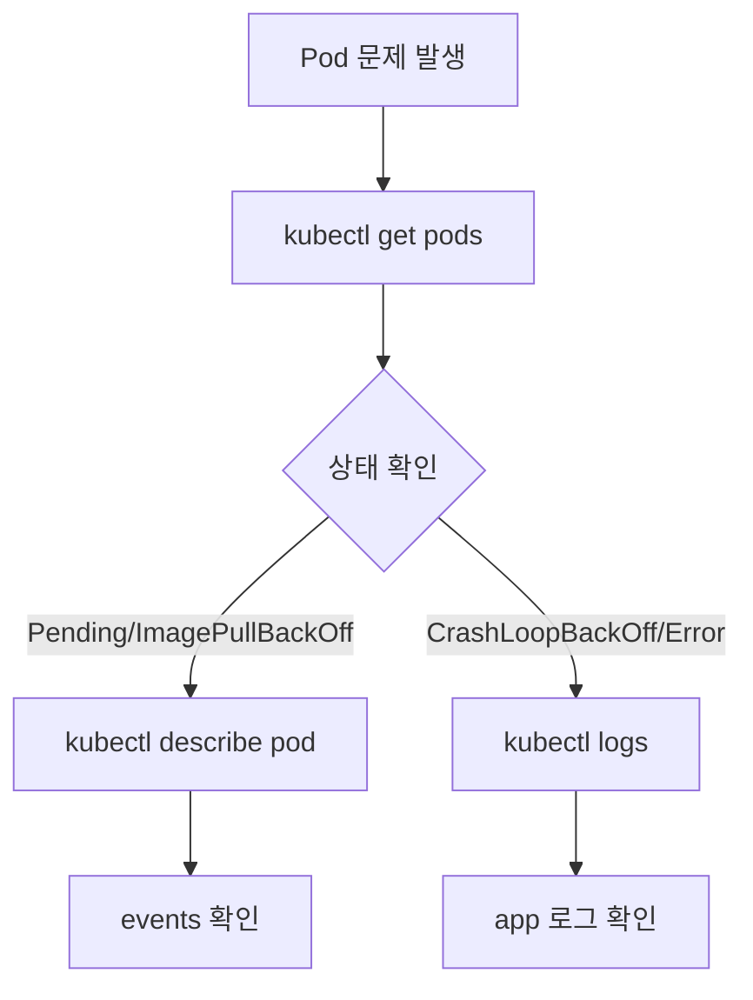
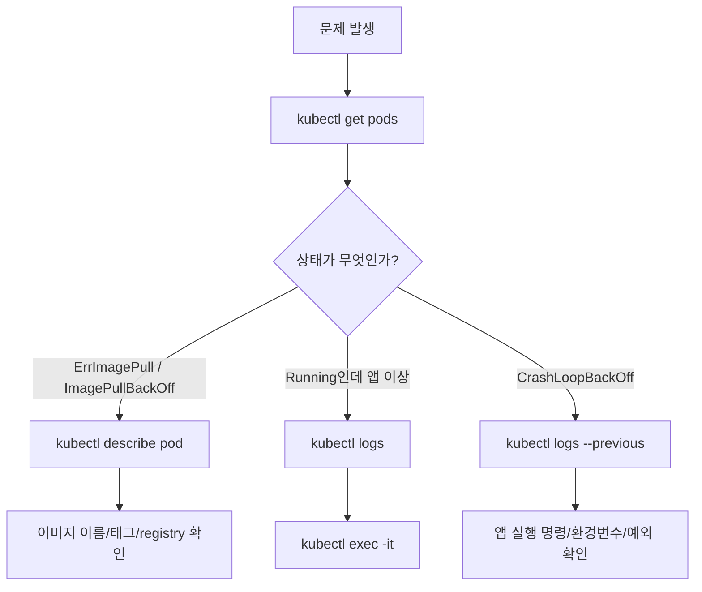
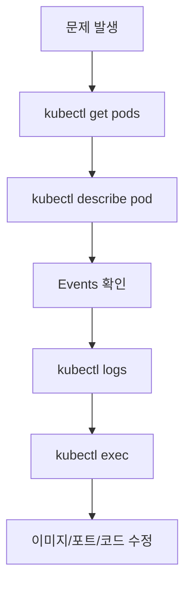

# 12. Pod 디버깅 방법

- 영상: [Pod 디버깅 방법](https://www.youtube.com/watch?v=btd7r1u1dsM)
- 플레이리스트: [JSCODE Kubernetes 입문/실전](https://www.youtube.com/playlist?list=PLtUgHNmvcs6pBvcX0ilCncJRgBHNs40vX)
- 문서 성격: 이 문서는 영상의 한국어 자막/스크립트를 확인한 뒤 재구성한 학습 문서다. 원문 스크립트를 복제하지 않고, 영상 흐름을 따라 개념 설명, 그림, 실습 코드를 보강했다.

## 이 챕터에서 얻어야 할 것

Pod가 실패했을 때 get, describe, logs, events로 원인을 좁히는 절차를 익힌다.

## 스크립트 기반 흐름 정리

- 영상은 Pod가 정상 실행되지 않을 때 어떤 명령어로 상태를 확인할지 정리한다.
- get은 현재 상태를 빠르게 보고, describe는 이벤트와 스케줄링/이미지 오류를 확인하는 데 유용하다.
- logs는 컨테이너 프로세스가 출력한 애플리케이션 로그를 확인한다.

## 근원탐색: 왜 이 개념이 필요한가

분산 환경에서 실패는 여러 계층에서 발생한다. YAML 오타, 이미지 pull 실패, 포트 불일치, 애플리케이션 crash, 스케줄링 실패가 모두 Pod 문제처럼 보일 수 있다. 디버깅은 계층을 나눠 원인을 좁히는 작업이다.

## 구조 그림



## 핵심 개념 해설

디버깅 챕터는 명령어 나열로 끝내면 안 된다. 먼저 상태를 보고, 이벤트를 보고, 그 다음 애플리케이션 로그를 본다. 이미지 pull 문제인지, 스케줄링 문제인지, 프로세스 crash인지에 따라 봐야 할 위치가 달라진다.

## 실습 매니페스트/코드

```yaml
apiVersion: v1
kind: Pod
metadata:
  name: debug-demo
spec:
  containers:
    - name: app
      image: wrong-image-name:latest
```

## 따라칠 명령어

```bash
kubectl get pods
```

```bash
kubectl describe pod debug-demo
```

```bash
kubectl logs pod/debug-demo
```

```bash
kubectl logs pod/debug-demo --previous
```

```bash
kubectl get events --sort-by=.lastTimestamp
```

## 확인 포인트

- Pod 상태 이름을 보고 먼저 어느 계층 문제인지 가설을 세운다.
- describe와 logs의 역할을 혼동하지 않는다.

## 강의 포인트 확장: 에러를 일부러 만들고 원인을 좁히기

영상은 Nginx 이미지 태그를 일부러 틀리게 적어 이미지 pull 오류를 만든 뒤, `describe`로 원인을 확인하는 흐름을 보여준다. Kubernetes 디버깅은 감으로 고치는 작업이 아니라 상태를 보고 원인을 좁히는 작업이다.

오류 재현 manifest:

```yaml
apiVersion: v1
kind: Pod
metadata:
  name: nginx-pod
spec:
  containers:
    - name: nginx-container
      image: nginx:wrong-tag
      ports:
        - containerPort: 80
```

```bash
kubectl apply -f nginx-pod.yaml
kubectl get pods
kubectl describe pod nginx-pod
```

디버깅 흐름:



정상 태그로 수정한 뒤 다시 적용한다.

```yaml
image: nginx:1.26.2
```

```bash
kubectl apply -f nginx-pod.yaml
kubectl logs nginx-pod
kubectl exec -it nginx-pod -- bash
kubectl exec -it nginx-pod -- sh
```

문서에 반드시 남길 포인트:

- `kubectl get pods`는 상태 요약이다.
- `kubectl describe pod`는 스케줄링, 이미지 pull, 이벤트 확인에 강하다.
- `kubectl logs`는 컨테이너 프로세스의 stdout/stderr를 본다.
- `kubectl exec`는 Pod 내부에서 직접 확인할 때 쓴다.
- 이미지에 `bash`가 없을 수 있으므로 `sh` fallback을 같이 적어야 한다.

## 영상 기반 상세 학습 노트

Pod 문제는 이미지 pull, 스케줄링, 컨테이너 시작, 애플리케이션 런타임, 네트워크 중 어디에서 발생했는지 나눠 봐야 한다. get으로 상태를 보고, describe로 Events를 읽고, logs로 앱 출력을 보고, exec로 내부를 확인한다.

### 화면/구조를 문서로 옮기면



### 실습할 때 같이 확인할 명령

```bash
kubectl get pods -o wide
kubectl describe pod <pod-name>
kubectl logs <pod-name>
kubectl logs <pod-name> --previous
kubectl exec -it <pod-name> -- sh
```

### 이 장에서 꼭 남길 관찰

- 명령이 성공했는지보다 어떤 객체의 상태가 바뀌었는지 먼저 적는다.
- 실패가 나오면 `get -> describe -> logs/events` 순서로 원인을 좁힌다.
- 안정화된 설명은 나중에 `docs/concepts/`로 승격하고, 실제 실행 결과는 `docs/labs/`에 남긴다.

## 자주 헷갈리는 지점

- Pod의 `containerPort`는 Docker의 `-p` 같은 포트포워딩 설정이 아니다. 실제로는 프로세스가 해당 포트를 listen해야 한다.

## 다음 문서로 승격할 내용

- `docs/concepts/pod.md`에 Pod의 실행 단위, 네트워크 namespace, containerPort 오해를 정리한다.
