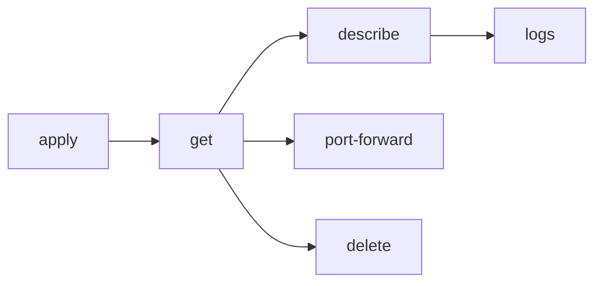
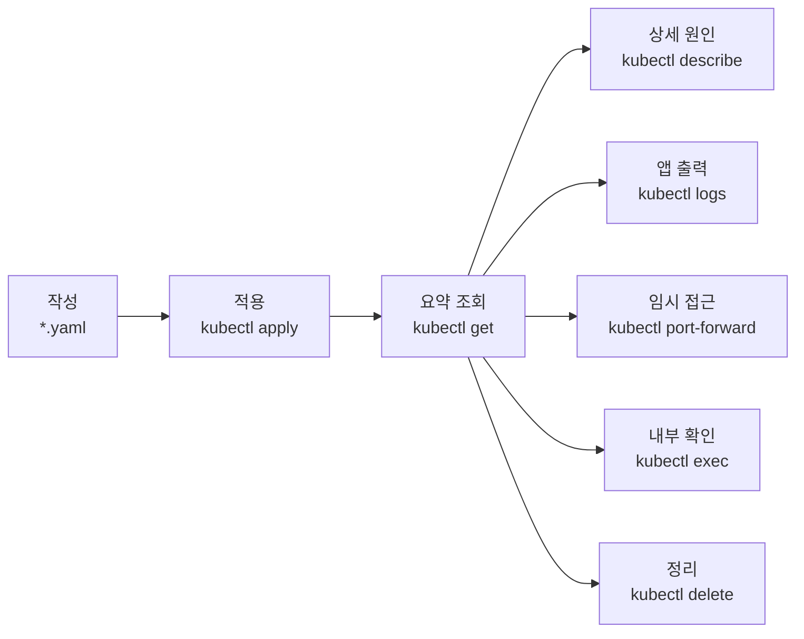
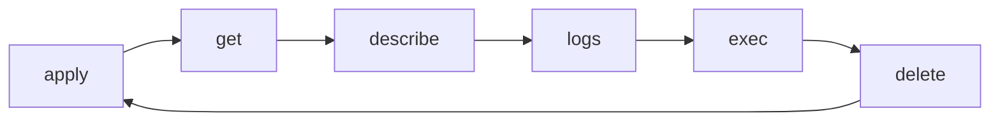

# 13. Pod 파트 명령어 정리

- 영상: [Pod 파트 명령어 정리](https://www.youtube.com/watch?v=jw7ye7BuQUI)
- 플레이리스트: [JSCODE Kubernetes 입문/실전](https://www.youtube.com/playlist?list=PLtUgHNmvcs6pBvcX0ilCncJRgBHNs40vX)
- 문서 성격: 이 문서는 영상의 한국어 자막/스크립트를 확인한 뒤 재구성한 학습 문서다. 원문 스크립트를 복제하지 않고, 영상 흐름을 따라 개념 설명, 그림, 실습 코드를 보강했다.

## 이 챕터에서 얻어야 할 것

Pod 실습에서 반복된 최소 kubectl 명령어를 정리한다.

## 스크립트 기반 흐름 정리

- 영상은 지금까지 사용한 Pod 관련 명령어를 짧게 요약한다.
- apply, get, describe, logs, delete, port-forward가 기본 세트다.
- 명령어는 외우는 것이 아니라 문제 상황에 맞춰 선택해야 한다.

## 근원탐색: 왜 이 개념이 필요한가

쿠버네티스 학습 초반에는 개념보다 손에 붙은 조회 습관이 중요하다. 상태를 볼 수 없으면 문제를 고칠 수 없다.

## 구조 그림



## 핵심 개념 해설

요약 챕터는 암기장이 아니라 리소스 관계를 압축해서 다시 확인하는 지점이다. 명령어를 사용할 때마다 “내가 지금 어떤 리소스의 어떤 상태를 확인하는가”를 함께 말할 수 있어야 한다.

## 실습 매니페스트/코드

```yaml
apiVersion: v1
kind: Pod
metadata:
  name: command-demo
spec:
  containers:
    - name: nginx
      image: nginx
      ports:
        - containerPort: 80
```

## 따라칠 명령어

```bash
kubectl apply -f pod.yaml
```

```bash
kubectl get pods -o wide
```

```bash
kubectl describe pod <pod-name>
```

```bash
kubectl logs <pod-name>
```

```bash
kubectl port-forward pod/<pod-name> 8080:80
```

```bash
kubectl delete -f pod.yaml
```

## 확인 포인트

- 각 명령어가 “생성, 조회, 상세, 로그, 접근, 삭제” 중 어디에 속하는지 분류한다.
- 이후 Deployment/Service에서도 같은 패턴이 반복된다는 점을 기억한다.

## 강의 포인트 확장: 명령어를 상황별로 다시 분류하기

영상은 짧지만, 이후 학습을 위해서는 명령어를 단순 목록이 아니라 문제 해결 흐름으로 정리해야 한다.



| 상황 | 명령어 | 해석 |
| --- | --- | --- |
| manifest 적용 | `kubectl apply -f pod.yaml` | 파일에 적힌 원하는 상태를 클러스터에 반영 |
| Pod 조회 | `kubectl get pods` | Pod 상태 요약 확인 |
| 상세 원인 확인 | `kubectl describe pod <pod>` | 이벤트, 이미지 pull, 스케줄링 단서 확인 |
| 로그 확인 | `kubectl logs <pod>` | 컨테이너 프로세스 출력 확인 |
| 내부 접속 | `kubectl exec -it <pod> -- sh` | 컨테이너 내부에서 직접 확인 |
| 임시 접근 | `kubectl port-forward pod/<pod> 8080:80` | 로컬 포트와 Pod 포트를 연결 |
| 삭제 | `kubectl delete -f pod.yaml` | manifest로 만든 리소스 정리 |

반복 연습 루틴:

```bash
kubectl apply -f pod.yaml
kubectl get pods -o wide
kubectl describe pod command-demo
kubectl logs command-demo
kubectl port-forward pod/command-demo 8080:80
kubectl delete -f pod.yaml
```

문서에 반드시 남길 포인트:

- `apply`는 생성 전용이 아니라 변경 반영에도 쓰인다.
- `get`은 짧은 요약, `describe`는 상세 이벤트, `logs`는 애플리케이션 출력이다.
- `delete pod <name>`보다 `delete -f <file>`이 실습 정리에 안전할 때가 많다.
- Pod에서 익힌 명령어 패턴은 Deployment와 Service에서도 반복된다.

## 영상 기반 상세 학습 노트

Pod 파트의 명령어는 만들고, 보고, 자세히 보고, 로그를 보고, 내부에 들어가고, 삭제하는 루프다. 이 루프는 Deployment와 Service에서도 리소스 이름만 바꿔 계속 반복된다.

### 화면/구조를 문서로 옮기면



### 실습할 때 같이 확인할 명령

```bash
kubectl apply -f pod.yaml
kubectl get pods
kubectl describe pod nginx-pod
kubectl logs nginx-pod
kubectl exec -it nginx-pod -- sh
kubectl delete -f pod.yaml
```

### 이 장에서 꼭 남길 관찰

- 명령이 성공했는지보다 어떤 객체의 상태가 바뀌었는지 먼저 적는다.
- 실패가 나오면 `get -> describe -> logs/events` 순서로 원인을 좁힌다.
- 안정화된 설명은 나중에 `docs/concepts/`로 승격하고, 실제 실행 결과는 `docs/labs/`에 남긴다.

## 자주 헷갈리는 지점

- Pod의 `containerPort`는 Docker의 `-p` 같은 포트포워딩 설정이 아니다. 실제로는 프로세스가 해당 포트를 listen해야 한다.

## 다음 문서로 승격할 내용

- `docs/concepts/pod.md`에 Pod의 실행 단위, 네트워크 namespace, containerPort 오해를 정리한다.
