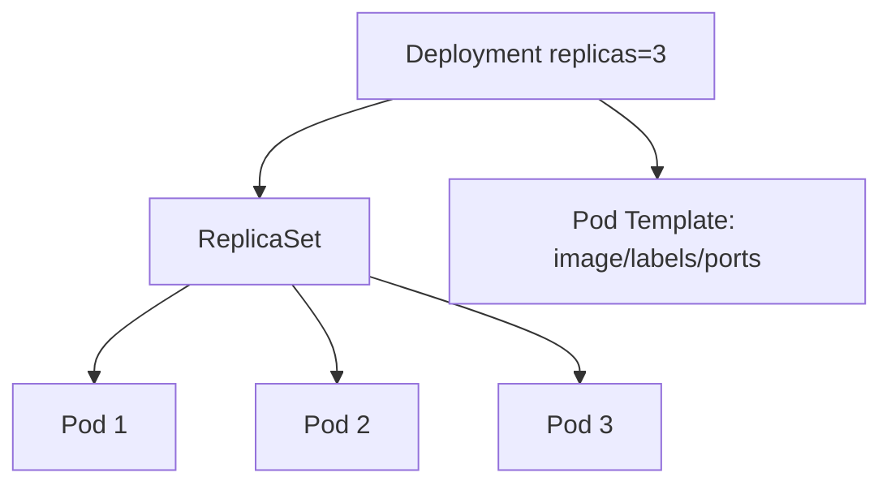
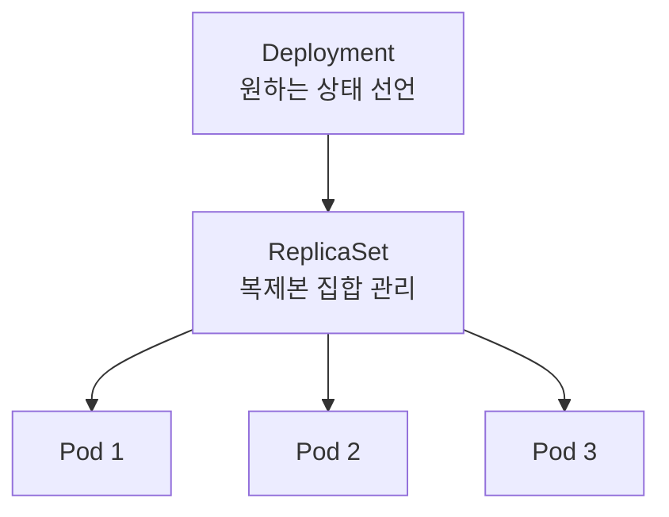
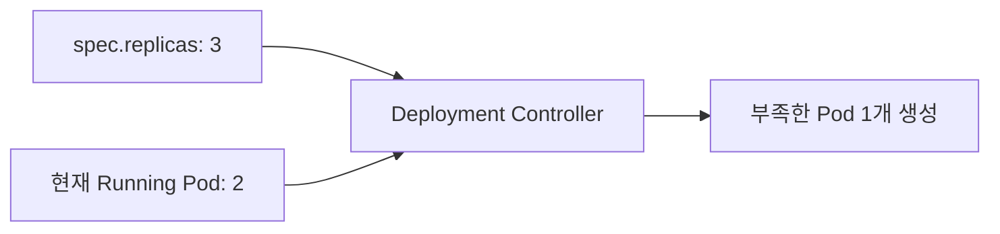
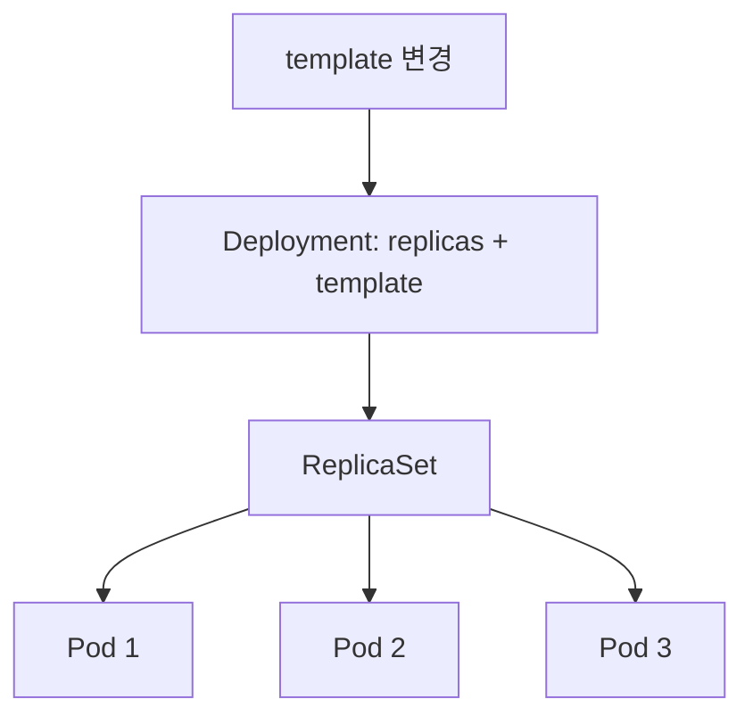

# 14. Deployment란 무엇인가

- 영상: [Deployment란 무엇인가](https://www.youtube.com/watch?v=n0c-SUP-p5Q)
- 플레이리스트: [JSCODE Kubernetes 입문/실전](https://www.youtube.com/playlist?list=PLtUgHNmvcs6pBvcX0ilCncJRgBHNs40vX)
- 문서 성격: 이 문서는 영상의 한국어 자막/스크립트를 확인한 뒤 재구성한 학습 문서다. 원문 스크립트를 복제하지 않고, 영상 흐름을 따라 개념 설명, 그림, 실습 코드를 보강했다.

## 이 챕터에서 얻어야 할 것

Deployment가 Pod의 원하는 개수와 업데이트를 관리하는 상위 리소스임을 이해한다.

## 스크립트 기반 흐름 정리

- 영상은 Pod를 직접 여러 개 관리하는 불편함에서 Deployment 개념으로 넘어간다.
- Deployment는 Pod template과 replicas를 선언하고, 컨트롤러가 실제 Pod 개수를 맞춘다.
- 내부적으로 ReplicaSet을 통해 Pod 복제본을 관리한다.

## 근원탐색: 왜 이 개념이 필요한가

운영자는 Pod 하나하나를 만들고 지우는 사람이 아니라 “이 버전의 서버가 3개 떠 있어야 한다”는 목표를 선언하고 싶다. Deployment는 이 목표를 Kubernetes 컨트롤 루프로 유지한다.

## 구조 그림




## 실습 매니페스트/코드

```yaml
apiVersion: apps/v1
kind: Deployment
metadata:
  name: backend
spec:
  replicas: 3
  selector:
    matchLabels:
      app: backend
  template:
    metadata:
      labels:
        app: backend
    spec:
      containers:
        - name: app
          image: your-registry/backend:latest
          ports:
            - containerPort: 8080
```

## 따라칠 명령어

```bash
kubectl apply -f deployment.yaml
```

```bash
kubectl get deployments
```

```bash
kubectl get replicasets
```

```bash
kubectl get pods -l app=backend
```

## 확인 포인트

- Deployment, ReplicaSet, Pod의 소유 관계를 설명한다.
- selector와 template labels가 맞아야 하는 이유를 이해한다.

## 강의 포인트 확장: Deployment를 왜 쓰는가

영상은 앞선 “Spring Boot Pod 3개 직접 생성” 실습의 불편함을 Deployment의 필요성으로 연결한다. Deployment는 Pod를 묶음으로 관리하게 해 주는 상위 리소스다. 현업에서는 지속적으로 운영할 애플리케이션을 Pod 단독으로 직접 배포하는 경우보다 Deployment로 배포하는 경우가 일반적이다.

Deployment가 제공하는 핵심 이점:

- 원하는 Pod 개수를 쉽게 선언한다.
- Pod가 비정상 종료되면 다시 만들어 개수를 유지한다.
- 여러 Pod를 한 번에 중지, 삭제, 업데이트할 수 있다.
- 이후 rolling update, rollback, self-healing의 기반이 된다.

구조 다이어그램:



원하는 상태와 실제 상태 관점:



개념 설명용 manifest:

```yaml
apiVersion: apps/v1
kind: Deployment
metadata:
  name: spring-deployment
spec:
  replicas: 3
  selector:
    matchLabels:
      app: backend-app
  template:
    metadata:
      labels:
        app: backend-app
    spec:
      containers:
        - name: spring-container
          image: spring-server
          ports:
            - containerPort: 8080
```

문서에 반드시 남길 포인트:

- Deployment는 Pod 여러 개를 “한 세트”처럼 다루게 해 준다.
- Deployment는 ReplicaSet을 만들고, ReplicaSet이 Pod 복제본을 관리한다.
- 사용자는 보통 ReplicaSet을 직접 작성하지 않고 Deployment를 작성한다.
- `replicas`는 “몇 개를 만들었는가”가 아니라 “몇 개가 유지되어야 하는가”이다.

## 영상 기반 상세 학습 노트

Deployment는 Pod 하나를 뜻하지 않는다. replicas와 Pod template을 선언하면 Deployment Controller와 ReplicaSet이 실제 Pod 개수를 맞추고 업데이트를 처리한다.

### 화면/구조를 문서로 옮기면



### 실습할 때 같이 확인할 명령

```bash
kubectl apply -f spring-deployment.yaml
kubectl get deployments
kubectl get replicasets
kubectl get pods -l app=spring-api
kubectl describe deployment spring-api
```

### 이 장에서 꼭 남길 관찰

- 명령이 성공했는지보다 어떤 객체의 상태가 바뀌었는지 먼저 적는다.
- 실패가 나오면 `get -> describe -> logs/events` 순서로 원인을 좁힌다.
- 안정화된 설명은 나중에 `docs/concepts/`로 승격하고, 실제 실행 결과는 `docs/labs/`에 남긴다.

## 자주 헷갈리는 지점

- Deployment가 Pod를 직접 실행하는 것처럼 보이지만 실제로는 ReplicaSet과 Pod template을 통해 원하는 상태를 유지한다.

## 다음 문서로 승격할 내용

- `docs/concepts/deployment.md`에 replicas, ReplicaSet, rollout, self-healing을 정리한다.
