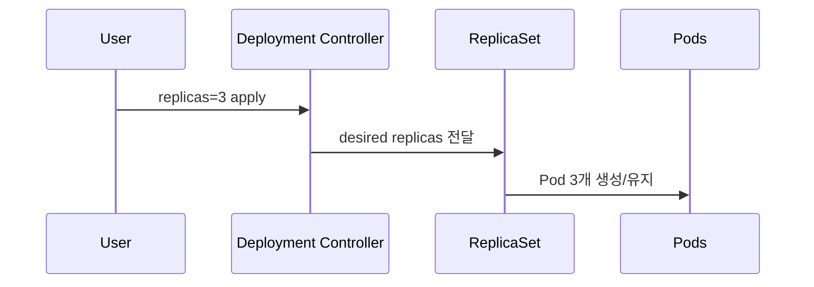
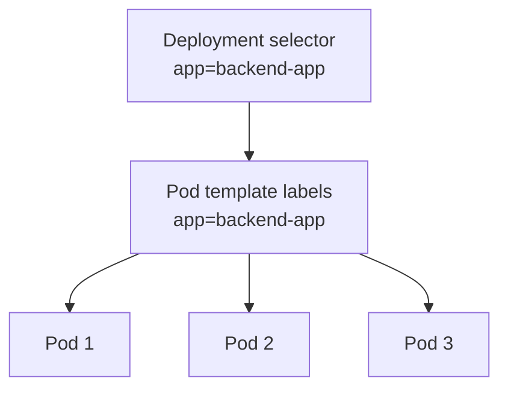
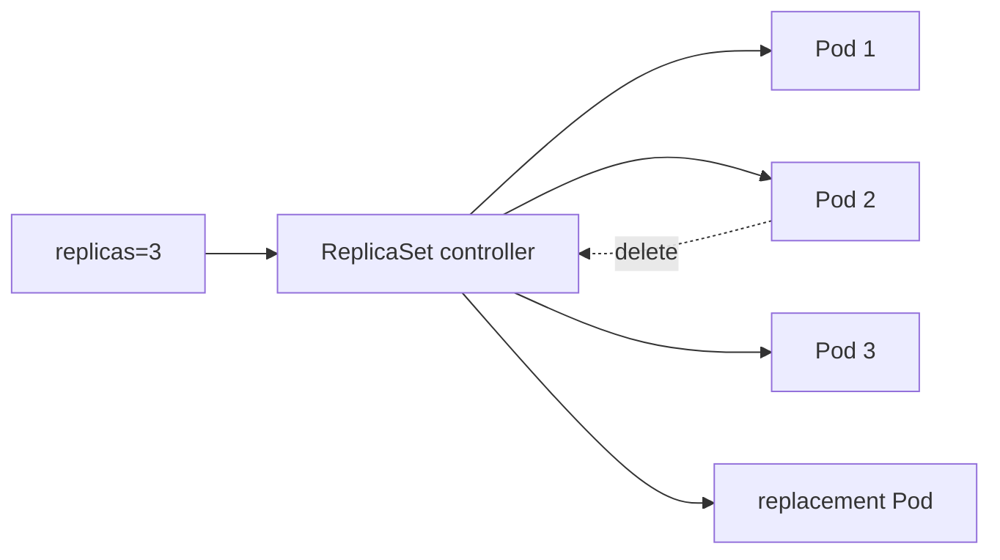

# 15. Deployment로 Spring Boot 서버 3개 실행하기

- 영상: [Deployment로 Spring Boot 서버 3개 실행하기](https://www.youtube.com/watch?v=TpXS309s-kA)
- 플레이리스트: [JSCODE Kubernetes 입문/실전](https://www.youtube.com/playlist?list=PLtUgHNmvcs6pBvcX0ilCncJRgBHNs40vX)
- 문서 성격: 이 문서는 영상의 한국어 자막/스크립트를 확인한 뒤 재구성한 학습 문서다. 원문 스크립트를 복제하지 않고, 영상 흐름을 따라 개념 설명, 그림, 실습 코드를 보강했다.

## 이 챕터에서 얻어야 할 것

replicas를 통해 동일한 Spring Boot Pod 3개를 선언적으로 실행한다.

## 스크립트 기반 흐름 정리

- 영상은 이전에 Pod를 3개 직접 만들던 흐름을 Deployment로 대체한다.
- replicas 값 하나로 서버 개수를 선언하고, kubectl로 Deployment와 생성된 Pod들을 확인한다.
- label과 selector가 Deployment가 어떤 Pod를 관리할지 결정한다.

## 근원탐색: 왜 이 개념이 필요한가

수동 Pod 3개는 “현재 3개 만들었다”일 뿐, “항상 3개 유지하라”가 아니다. Deployment는 원하는 개수를 지속적으로 맞춘다.

## 구조 그림



## 핵심 개념 해설

Deployment 실습은 replicas, selector, template 세 필드의 관계를 정확히 보는 것이 핵심이다. replicas는 원하는 개수, selector는 관리 대상 식별 방식, template은 새 Pod를 만들 때 사용할 설계도다.

## 실습 매니페스트/코드

```yaml
apiVersion: apps/v1
kind: Deployment
metadata:
  name: spring-backend
spec:
  replicas: 3
  selector:
    matchLabels:
      app: spring-backend
  template:
    metadata:
      labels:
        app: spring-backend
    spec:
      containers:
        - name: app
          image: your-registry/spring-backend:latest
          ports:
            - containerPort: 8080
```

## 따라칠 명령어

```bash
kubectl apply -f spring-backend-deployment.yaml
```

```bash
kubectl get deploy spring-backend
```

```bash
kubectl get pods -l app=spring-backend -o wide
```

```bash
kubectl describe deploy spring-backend
```

## 확인 포인트

- Pod 3개가 Deployment 이름에서 파생된 이름을 갖는지 확인한다.
- Pod를 하나 삭제했을 때 Deployment가 다시 3개를 맞추는지 다음 self-healing과 연결한다.

## 강의 포인트 확장: replicas, selector, template을 한 번에 이해하기

이 강의는 Deployment manifest를 직접 작성하는 첫 실습이다. 중심은 `replicas`, `selector`, `template` 세 필드다.

```yaml
apiVersion: apps/v1
kind: Deployment
metadata:
  name: spring-deployment
spec:
  replicas: 3
  selector:
    matchLabels:
      app: backend-app
  template:
    metadata:
      labels:
        app: backend-app
    spec:
      containers:
        - name: spring-container
          image: spring-server
          imagePullPolicy: IfNotPresent
          ports:
            - containerPort: 8080
```

| 필드 | 의미 |
| --- | --- |
| `apiVersion: apps/v1` | Deployment는 apps API group에 속한다 |
| `kind: Deployment` | Deployment 리소스를 만든다 |
| `replicas: 3` | Spring Boot Pod를 3개 유지한다 |
| `selector.matchLabels` | Deployment가 관리할 Pod 라벨 조건 |
| `template.metadata.labels` | 새로 만들 Pod에 붙일 라벨 |
| `template.spec.containers` | Pod 내부 컨테이너 정의 |

`selector`와 `template.labels` 관계:



조회 명령어:

```bash
kubectl apply -f spring-deployment.yaml
kubectl get deployments
kubectl get replicasets
kubectl get pods
kubectl get pods -l app=backend-app -o wide
```

문서에 반드시 남길 포인트:

- 직접 Pod 3개를 쓰지 않아도 Deployment가 Pod 3개를 만든다.
- ReplicaSet 이름과 Pod 이름은 Deployment 이름에서 파생되며 해시가 붙는다.
- `selector.matchLabels`와 `template.metadata.labels`가 맞지 않으면 Deployment가 Pod를 제대로 관리할 수 없다.
- Deployment로 서버 3개를 띄워도 요청 분산 문제는 아직 남는다. 그래서 Service가 다음에 필요하다.

## 영상 기반 상세 학습 노트

replicas: 3은 Pod 세 개를 한 번 만들라는 명령이 아니라 계속 세 개를 유지하라는 선언이다. Pod 하나를 삭제해도 ReplicaSet이 새 Pod를 만들기 때문에 직접 복제와 차이가 드러난다.

### 화면/구조를 문서로 옮기면



### 실습할 때 같이 확인할 명령

```bash
kubectl apply -f spring-deployment.yaml
kubectl get pods -l app=spring-api -o wide
kubectl delete pod <one-pod-name>
kubectl get pods -l app=spring-api -w
```

### 이 장에서 꼭 남길 관찰

- 명령이 성공했는지보다 어떤 객체의 상태가 바뀌었는지 먼저 적는다.
- 실패가 나오면 `get -> describe -> logs/events` 순서로 원인을 좁힌다.
- 안정화된 설명은 나중에 `docs/concepts/`로 승격하고, 실제 실행 결과는 `docs/labs/`에 남긴다.

## 자주 헷갈리는 지점

- Deployment가 Pod를 직접 실행하는 것처럼 보이지만 실제로는 ReplicaSet과 Pod template을 통해 원하는 상태를 유지한다.
- 영상의 이미지 이름과 포트는 실습 코드에 맞게 바뀔 수 있다. 실제로 따라칠 때는 Dockerfile과 애플리케이션 listen port를 먼저 확인한다.

## 다음 문서로 승격할 내용

- `docs/concepts/deployment.md`에 replicas, ReplicaSet, rollout, self-healing을 정리한다.
