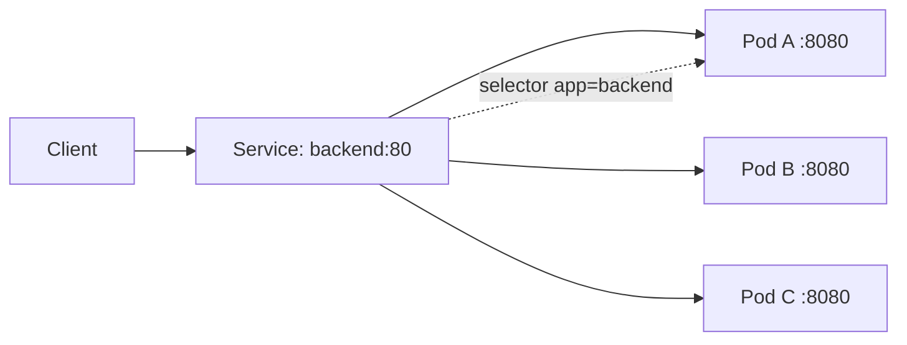
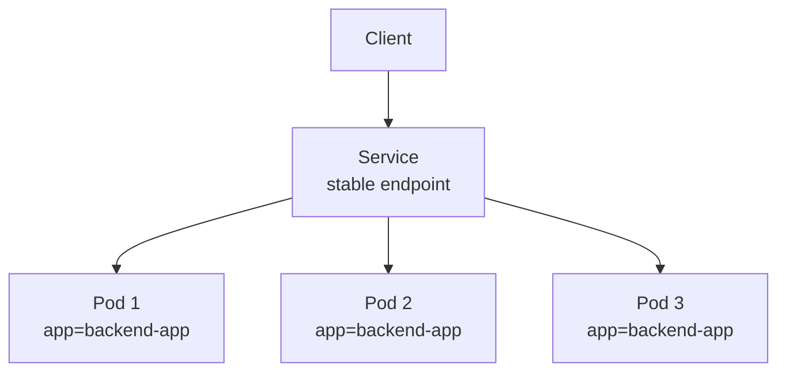
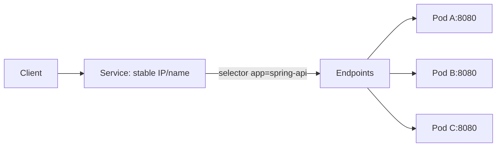

# 16. Service란 무엇인가

- 영상: [Service란 무엇인가](https://www.youtube.com/watch?v=ZUVdX8wk-wM)
- 플레이리스트: [JSCODE Kubernetes 입문/실전](https://www.youtube.com/playlist?list=PLtUgHNmvcs6pBvcX0ilCncJRgBHNs40vX)
- 문서 성격: 이 문서는 영상의 한국어 자막/스크립트를 확인한 뒤 재구성한 학습 문서다. 원문 스크립트를 복제하지 않고, 영상 흐름을 따라 개념 설명, 그림, 실습 코드를 보강했다.

## 이 챕터에서 얻어야 할 것

Service가 변하는 Pod 집합 앞에 안정적인 접근 지점을 제공한다는 점을 이해한다.

## 스크립트 기반 흐름 정리

- 영상은 Deployment로 Pod가 여러 개 생긴 뒤 어디로 접속해야 하는지 문제를 제기한다.
- Pod IP는 재생성되면 바뀔 수 있기 때문에 클라이언트가 직접 Pod IP를 바라보면 불안정하다.
- Service는 label selector로 Pod 집합을 고르고, 고정된 이름과 IP로 접근을 제공한다.

## 근원탐색: 왜 이 개념이 필요한가

복제와 self-healing은 Pod를 계속 바꾼다. 하지만 호출하는 쪽은 안정적인 주소 하나를 원한다. Service는 동적인 Pod 집합과 안정적인 클라이언트 접근 사이의 간접 계층이다.

## 구조 그림




## 실습 매니페스트/코드

```yaml
apiVersion: v1
kind: Service
metadata:
  name: backend-service
spec:
  selector:
    app: backend
  ports:
    - port: 80
      targetPort: 8080
  type: ClusterIP
```

## 따라칠 명령어

```bash
kubectl apply -f service.yaml
```

```bash
kubectl get svc
```

```bash
kubectl get endpoints backend-service
```

```bash
kubectl describe svc backend-service
```

## 확인 포인트

- Service의 port와 targetPort를 구분한다.
- Service가 컨테이너를 직접 고르는 것이 아니라 label selector로 Pod를 고른다는 점을 기억한다.

## 강의 포인트 확장: Service가 등장하는 정확한 이유

영상은 Deployment로 Pod 3개를 만들었지만, 사용자 요청을 어느 Pod로 보내야 하는지 문제가 남는다는 점에서 Service를 도입한다. Pod IP는 동적이고, Pod 개수도 변한다. 호출자가 Pod IP 목록을 직접 알고 요청을 나누는 구조는 운영에 맞지 않는다.

Service는 두 가지 문제를 동시에 해결한다.

- 변하는 Pod 집합 앞에 안정적인 접근 지점을 만든다.
- selector로 고른 여러 Pod에 요청을 분산한다.

구조 다이어그램:



Service type 요약:

| Type | 접근 범위 | 용도 |
| --- | --- | --- |
| `ClusterIP` | 클러스터 내부 | 내부 서비스 간 통신 |
| `NodePort` | 노드의 포트를 통해 외부 접근 | 로컬/기초 실습 |
| `LoadBalancer` | 외부 로드밸런서 연동 | 클라우드 공개 서비스 |

Service 개념 예시 YAML:

```yaml
apiVersion: v1
kind: Service
metadata:
  name: spring-service
spec:
  type: NodePort
  selector:
    app: backend-app
  ports:
    - protocol: TCP
      port: 8080
      targetPort: 8080
      nodePort: 30000
```

문서에 반드시 남길 포인트:

- Kubernetes의 Service는 일반적인 “비즈니스 서비스”라는 말과 다르다.
- Service는 Pod를 직접 실행하지 않고 네트워크 진입점을 제공한다.
- Service는 label selector로 대상 Pod를 고른다.
- Service가 있어야 여러 Pod 앞에 안정적인 호출 지점을 둘 수 있다.
- 외부 공개가 필요한지, 내부 통신만 필요한지에 따라 Service type을 다르게 선택한다.

## 영상 기반 상세 학습 노트

Deployment가 Pod를 여러 개 만들면 Pod IP가 계속 바뀌는 문제가 생긴다. Service는 label selector로 Pod 집합을 선택하고 그 앞에 안정적인 이름과 IP, 포트를 제공한다.

### 화면/구조를 문서로 옮기면



### 실습할 때 같이 확인할 명령

```bash
kubectl apply -f spring-service.yaml
kubectl get svc spring-api-service
kubectl get endpoints spring-api-service
kubectl port-forward svc/spring-api-service 8080:80
```

### 이 장에서 꼭 남길 관찰

- 명령이 성공했는지보다 어떤 객체의 상태가 바뀌었는지 먼저 적는다.
- 실패가 나오면 `get -> describe -> logs/events` 순서로 원인을 좁힌다.
- 안정화된 설명은 나중에 `docs/concepts/`로 승격하고, 실제 실행 결과는 `docs/labs/`에 남긴다.

## 자주 헷갈리는 지점

- Service는 컨테이너를 직접 선택하지 않는다. label selector로 Pod를 고르고, Service port를 Pod의 targetPort로 전달한다.

## 다음 문서로 승격할 내용

- `docs/concepts/service.md`에 selector, endpoint, port/targetPort, 안정적 접근 지점 개념을 정리한다.
