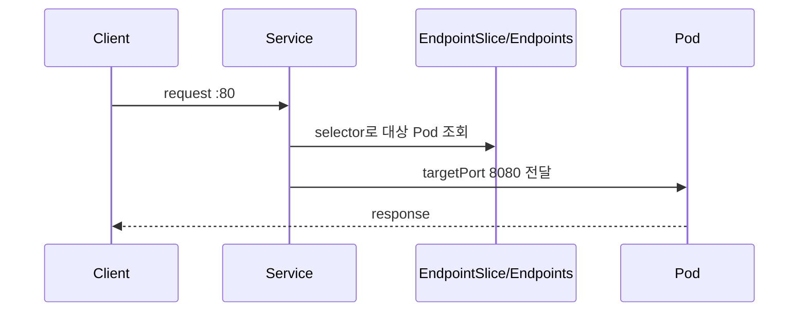
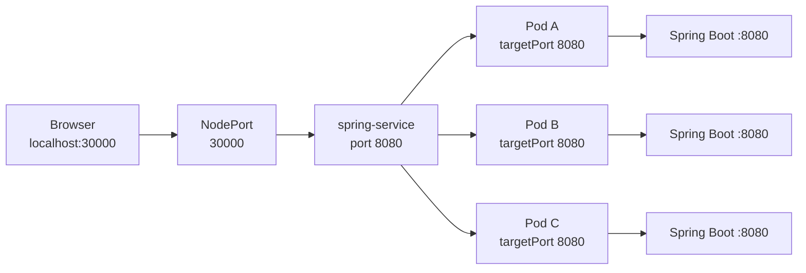
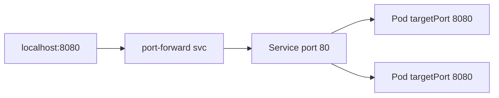

# 17. Service로 백엔드와 통신하기

- 영상: [Service로 백엔드와 통신하기](https://www.youtube.com/watch?v=80TJCAO5U4c)
- 플레이리스트: [JSCODE Kubernetes 입문/실전](https://www.youtube.com/playlist?list=PLtUgHNmvcs6pBvcX0ilCncJRgBHNs40vX)
- 문서 성격: 이 문서는 영상의 한국어 자막/스크립트를 확인한 뒤 재구성한 학습 문서다. 원문 스크립트를 복제하지 않고, 영상 흐름을 따라 개념 설명, 그림, 실습 코드를 보강했다.

## 이 챕터에서 얻어야 할 것

Service를 통해 Spring Boot Deployment 뒤의 Pod들에 안정적으로 접근한다.

## 스크립트 기반 흐름 정리

- 영상은 Spring Boot Deployment 앞에 Service를 붙여 통신하는 실습을 진행한다.
- 클라이언트는 개별 Pod IP가 아니라 Service 이름 또는 Service IP로 접근한다.
- Service가 selector에 맞는 Pod endpoint로 트래픽을 전달하는 흐름을 확인한다.

## 근원탐색: 왜 이 개념이 필요한가

Pod가 3개면 클라이언트가 어느 Pod를 호출해야 하는지 알기 어렵다. Pod가 죽고 새로 생기면 IP도 바뀐다. Service는 이 변동성을 숨긴다.

## 구조 그림



## 핵심 개념 해설

Service 실습에서는 selector와 endpoint를 반드시 같이 확인해야 한다. Service 자체가 생성되어도 selector에 맞는 Pod가 없거나 targetPort가 틀리면 트래픽은 도착하지 않는다.

## 실습 매니페스트/코드

```yaml
apiVersion: v1
kind: Service
metadata:
  name: spring-backend
spec:
  type: ClusterIP
  selector:
    app: spring-backend
  ports:
    - name: http
      port: 80
      targetPort: 8080
```

## 따라칠 명령어

```bash
kubectl apply -f spring-backend-service.yaml
```

```bash
kubectl get svc spring-backend
```

```bash
kubectl get endpoints spring-backend
```

```bash
kubectl port-forward svc/spring-backend 8080:80
```

```bash
curl http://localhost:8080
```

## 확인 포인트

- Service에 port-forward할 수도 있고 Pod에 port-forward할 수도 있다는 차이를 확인한다.
- selector가 잘못되면 Service endpoint가 비는 것을 확인한다.

## 강의 포인트 확장: NodePort, port, targetPort를 그림으로 고정하기

영상에서는 Spring Boot Deployment 앞에 NodePort Service를 만든다. 이때 가장 중요한 부분은 `nodePort`, `port`, `targetPort`가 각각 어느 경계를 연결하는지다.

강의 흐름에 맞춘 manifest:

```yaml
apiVersion: v1
kind: Service
metadata:
  name: spring-service
spec:
  type: NodePort
  selector:
    app: backend-app
  ports:
    - protocol: TCP
      port: 8080
      targetPort: 8080
      nodePort: 30000
```

| 필드 | 의미 |
| --- | --- |
| `nodePort: 30000` | 외부에서 노드로 들어오는 포트 |
| `port: 8080` | Service가 노출하는 포트 |
| `targetPort: 8080` | Service가 Pod로 전달할 때 사용하는 포트 |

요청 흐름:



생성과 확인:

```bash
kubectl apply -f spring-service.yaml
kubectl get services
kubectl get endpoints spring-service
```

로컬 환경에서 확인:

```bash
curl http://localhost:30000
```

일반 노드 환경이라면:

```bash
curl http://<node-ip>:30000
```

문서에 반드시 남길 포인트:

- Service는 `selector: app=backend-app`으로 Deployment가 만든 Pod들을 찾는다.
- Service가 생성되어도 endpoint가 비어 있으면 요청은 전달되지 않는다.
- `containerPort`는 문서화 성격이고, Service가 실제로 전달할 대상은 `targetPort`다.
- NodePort는 보통 `30000-32767` 범위에서 사용한다.
- 로컬 Kubernetes 환경에서는 `localhost:30000`이 동작할 수 있지만, 일반 클러스터에서는 `<NodeIP>:30000`으로 접근한다고 설명해야 한다.

## 영상 기반 상세 학습 노트

Service는 Deployment를 직접 선택하는 것이 아니라 Deployment가 만든 Pod의 label을 선택한다. port는 Service가 받는 포트, targetPort는 Pod 안 애플리케이션이 listen하는 포트다.

### 화면/구조를 문서로 옮기면



### 실습할 때 같이 확인할 명령

```bash
kubectl apply -f spring-deployment.yaml
kubectl apply -f spring-service.yaml
kubectl get deploy,pod,svc,endpoints
kubectl port-forward svc/spring-api-service 8080:80
curl http://localhost:8080
```

### 이 장에서 꼭 남길 관찰

- 명령이 성공했는지보다 어떤 객체의 상태가 바뀌었는지 먼저 적는다.
- 실패가 나오면 `get -> describe -> logs/events` 순서로 원인을 좁힌다.
- 안정화된 설명은 나중에 `docs/concepts/`로 승격하고, 실제 실행 결과는 `docs/labs/`에 남긴다.

## 자주 헷갈리는 지점

- Service는 컨테이너를 직접 선택하지 않는다. label selector로 Pod를 고르고, Service port를 Pod의 targetPort로 전달한다.
- 영상의 이미지 이름과 포트는 실습 코드에 맞게 바뀔 수 있다. 실제로 따라칠 때는 Dockerfile과 애플리케이션 listen port를 먼저 확인한다.

## 다음 문서로 승격할 내용

- `docs/concepts/service.md`에 selector, endpoint, port/targetPort, 안정적 접근 지점 개념을 정리한다.
