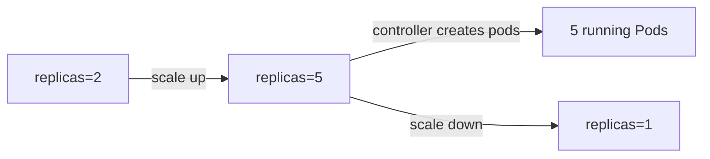
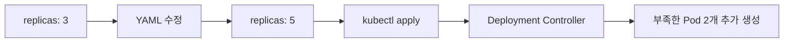
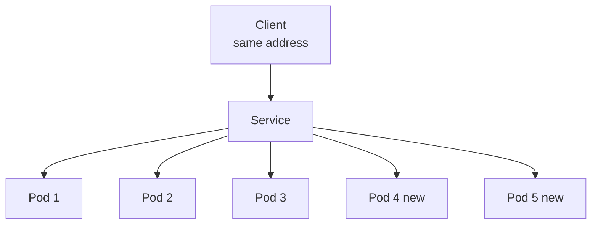
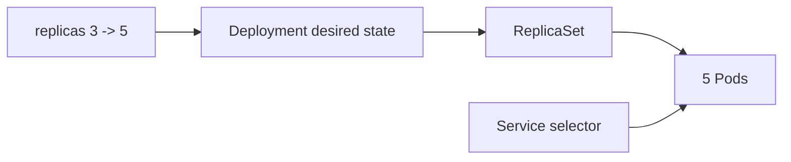

# 18. Deployment로 서버 개수 조절하기

- 영상: [Deployment로 서버 개수 조절하기](https://www.youtube.com/watch?v=2WudZUNrY2w)
- 플레이리스트: [JSCODE Kubernetes 입문/실전](https://www.youtube.com/playlist?list=PLtUgHNmvcs6pBvcX0ilCncJRgBHNs40vX)
- 문서 성격: 이 문서는 영상의 한국어 자막/스크립트를 확인한 뒤 재구성한 학습 문서다. 원문 스크립트를 복제하지 않고, 영상 흐름을 따라 개념 설명, 그림, 실습 코드를 보강했다.

## 이 챕터에서 얻어야 할 것

replicas 값을 바꾸어 서버 수를 늘리고 줄이는 방식을 익힌다.

## 스크립트 기반 흐름 정리

- 영상은 Deployment의 replicas 값을 통해 서버 개수를 조절하는 방법을 보여준다.
- YAML을 수정하거나 kubectl scale 명령으로 원하는 Pod 개수를 바꿀 수 있다.
- 컨트롤러는 새 원하는 상태에 맞게 Pod를 생성하거나 삭제한다.

## 근원탐색: 왜 이 개념이 필요한가

트래픽이 늘거나 줄면 서버 개수를 조절해야 한다. 수동으로 Pod를 만들고 지우는 방식은 운영에 취약하다. Deployment는 scale이라는 추상화로 수평 확장을 제공한다.

## 구조 그림



## 핵심 개념 해설

Deployment 실습은 replicas, selector, template 세 필드의 관계를 정확히 보는 것이 핵심이다. replicas는 원하는 개수, selector는 관리 대상 식별 방식, template은 새 Pod를 만들 때 사용할 설계도다.

## 실습 매니페스트/코드

```yaml
apiVersion: apps/v1
kind: Deployment
metadata:
  name: backend
spec:
  replicas: 5
  selector:
    matchLabels:
      app: backend
  template:
    metadata:
      labels:
        app: backend
    spec:
      containers:
        - name: app
          image: your-registry/backend:latest
```

## 따라칠 명령어

```bash
kubectl scale deployment/backend --replicas=5
```

```bash
kubectl get pods -l app=backend
```

```bash
kubectl scale deployment/backend --replicas=1
```

```bash
kubectl rollout status deployment/backend
```

## 확인 포인트

- scale은 Pod를 직접 다루는 명령이 아니라 Deployment의 desired replicas를 바꾸는 명령임을 이해한다.
- Service가 있으면 Pod 개수가 바뀌어도 클라이언트 접근 주소는 유지된다.

## 강의 포인트 확장: replicas 변경으로 수평 확장 확인하기

영상은 Deployment의 `replicas` 값을 3에서 5로 바꿔 서버 개수를 늘리는 흐름을 보여준다. 여기서 중요한 점은 새 Pod YAML을 복사하지 않는다는 것이다. 원하는 복제본 수만 바꾸고 다시 `apply`한다.

변경 전:

```yaml
spec:
  replicas: 3
```

변경 후:

```yaml
spec:
  replicas: 5
```

적용:

```bash
kubectl apply -f spring-deployment.yaml
```

확인:

```bash
kubectl get deployments
kubectl get pods
```

다이어그램:



Service와 함께 보면 더 중요하다.



명령형 scale도 비교용으로 넣을 수 있다.

```bash
kubectl scale deployment spring-deployment --replicas=5
```

문서에 반드시 남길 포인트:

- Deployment의 `replicas`는 서버 개수를 직접 복사하지 않고 선언적으로 조절하는 지점이다.
- `kubectl apply`는 생성뿐 아니라 변경 반영에도 사용된다.
- 기존 Pod 3개에 새 Pod 2개가 추가되는지 `AGE`로 확인할 수 있다.
- Service가 있다면 서버 개수가 바뀌어도 클라이언트 접근 주소는 그대로 유지된다.
- `kubectl scale`은 빠르지만 manifest와 실제 상태가 어긋날 수 있으므로 실습 후 YAML과 맞춰야 한다.

## 영상 기반 상세 학습 노트

서버 개수 조절은 Pod를 직접 만들고 지우는 것이 아니라 Deployment의 replicas 값을 바꾸는 문제다. Service는 selector로 Pod 집합을 보므로 replicas가 늘어나도 클라이언트가 보는 접근 지점은 유지된다.

### 화면/구조를 문서로 옮기면



### 실습할 때 같이 확인할 명령

```bash
kubectl scale deployment spring-api --replicas=5
kubectl get pods -l app=spring-api -w
kubectl get endpoints spring-api-service
kubectl scale deployment spring-api --replicas=2
```

### 이 장에서 꼭 남길 관찰

- 명령이 성공했는지보다 어떤 객체의 상태가 바뀌었는지 먼저 적는다.
- 실패가 나오면 `get -> describe -> logs/events` 순서로 원인을 좁힌다.
- 안정화된 설명은 나중에 `docs/concepts/`로 승격하고, 실제 실행 결과는 `docs/labs/`에 남긴다.

## 자주 헷갈리는 지점

- Deployment가 Pod를 직접 실행하는 것처럼 보이지만 실제로는 ReplicaSet과 Pod template을 통해 원하는 상태를 유지한다.
- 영상의 이미지 이름과 포트는 실습 코드에 맞게 바뀔 수 있다. 실제로 따라칠 때는 Dockerfile과 애플리케이션 listen port를 먼저 확인한다.

## 다음 문서로 승격할 내용

- `docs/concepts/deployment.md`에 replicas, ReplicaSet, rollout, self-healing을 정리한다.
