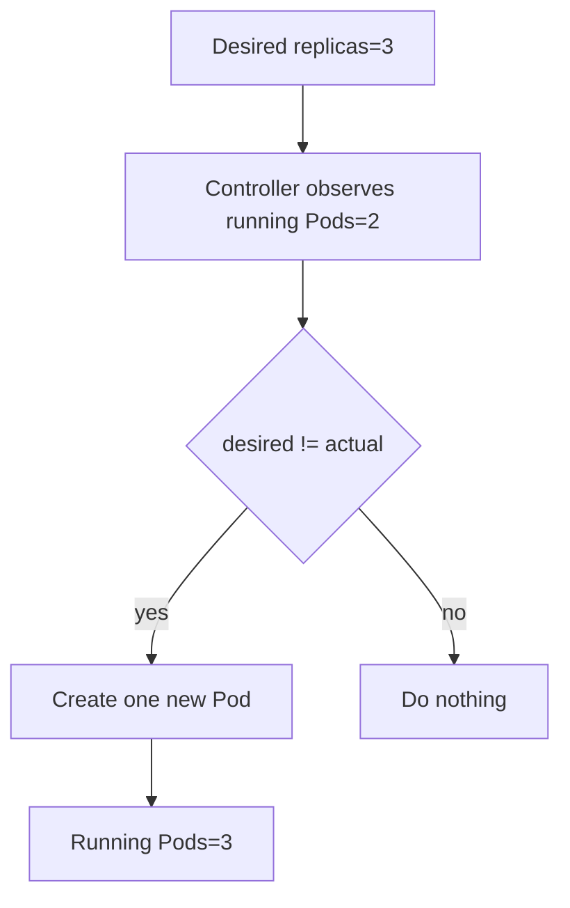
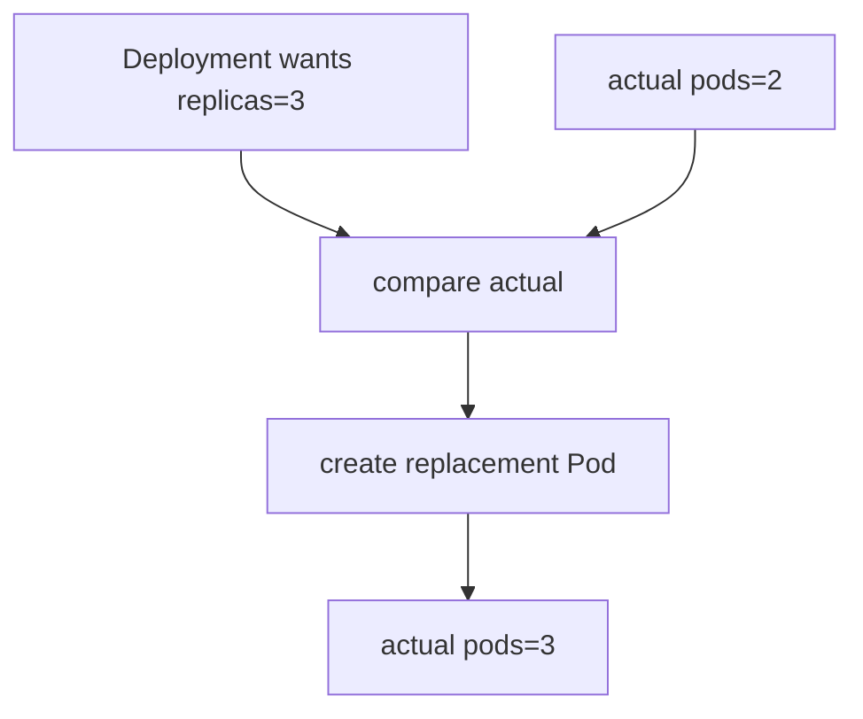

# 19. Self-Healing: 서버가 죽었을 때 자동 복구

- 영상: [Self-Healing: 서버가 죽었을 때 자동 복구](https://www.youtube.com/watch?v=gu9nSKpd4mA)
- 플레이리스트: [JSCODE Kubernetes 입문/실전](https://www.youtube.com/playlist?list=PLtUgHNmvcs6pBvcX0ilCncJRgBHNs40vX)
- 문서 성격: 이 문서는 영상의 한국어 자막/스크립트를 확인한 뒤 재구성한 학습 문서다. 원문 스크립트를 복제하지 않고, 영상 흐름을 따라 개념 설명, 그림, 실습 코드를 보강했다.

## 이 챕터에서 얻어야 할 것

Deployment가 원하는 Pod 개수를 유지하며 장애를 자동 복구하는 방식을 이해한다.

## 스크립트 기반 흐름 정리

- 영상은 Pod 하나를 죽였을 때 Kubernetes가 새 Pod를 만들어 개수를 맞추는 흐름을 보여준다.
- 이 동작은 마법이 아니라 Deployment/ReplicaSet 컨트롤러가 실제 상태와 원하는 상태를 계속 비교한 결과다.
- Self-Healing은 장애가 없다는 뜻이 아니라 장애 후 원하는 상태로 되돌린다는 뜻이다.

## 근원탐색: 왜 이 개념이 필요한가

프로세스와 서버는 언제든 죽을 수 있다. 사람이 매번 재시작하면 운영은 불가능하다. Kubernetes는 컨트롤 루프를 통해 선언된 상태와 실제 상태의 차이를 줄인다.

## 구조 그림



## 핵심 개념 해설

Kubernetes 컨트롤러는 계속 관찰하고 비교하고 수정한다. Self-Healing은 어떤 특별한 자동 재시작 명령이 아니라 원하는 상태와 실제 상태를 맞추는 반복 루프의 결과다.

## 실습 매니페스트/코드

```yaml
apiVersion: apps/v1
kind: Deployment
metadata:
  name: self-healing-demo
spec:
  replicas: 3
  selector:
    matchLabels:
      app: self-healing-demo
  template:
    metadata:
      labels:
        app: self-healing-demo
    spec:
      containers:
        - name: nginx
          image: nginx
```

## 따라칠 명령어

```bash
kubectl get pods -l app=self-healing-demo
```

```bash
kubectl delete pod <one-pod-name>
```

```bash
kubectl get pods -w
```

```bash
kubectl describe rs
```

## 확인 포인트

- Pod 삭제가 실패가 아니라 컨트롤러 동작을 확인하는 실험임을 이해한다.
- Self-Healing의 주체가 Pod 자체가 아니라 컨트롤러라는 점을 기억한다.

## 영상 기반 상세 학습 노트

Self-healing은 원하는 상태와 실제 상태의 차이를 줄이는 제어 루프의 결과다. 컨테이너 재시작은 kubelet의 영역이고, Pod 자체가 사라졌을 때 새 Pod를 만드는 것은 Deployment/ReplicaSet의 영역이다.

### 화면/구조를 문서로 옮기면



### 실습할 때 같이 확인할 명령

```bash
kubectl get pods -l app=spring-api
kubectl delete pod <one-pod-name>
kubectl get pods -l app=spring-api -w
kubectl describe deployment spring-api
```

### 이 장에서 꼭 남길 관찰

- 명령이 성공했는지보다 어떤 객체의 상태가 바뀌었는지 먼저 적는다.
- 실패가 나오면 `get -> describe -> logs/events` 순서로 원인을 좁힌다.
- 안정화된 설명은 나중에 `docs/concepts/`로 승격하고, 실제 실행 결과는 `docs/labs/`에 남긴다.

## 자주 헷갈리는 지점

- 리소스 이름보다 이 리소스가 해결하는 운영 문제를 먼저 기억한다.

## 다음 문서로 승격할 내용

- 실습 결과는 `docs/labs/`에 따로 남기고, 반복해서 재사용할 개념은 `docs/concepts/`로 승격한다.
