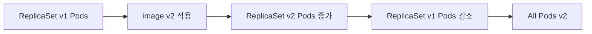
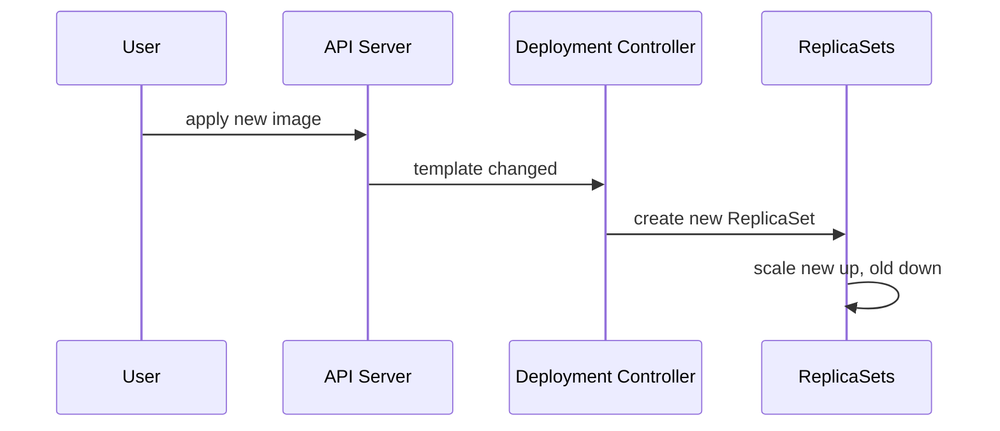

# 20. 새 서버 버전으로 업데이트하기

- 영상: [새 서버 버전으로 업데이트하기](https://www.youtube.com/watch?v=xJSkPfIYK70)
- 플레이리스트: [JSCODE Kubernetes 입문/실전](https://www.youtube.com/playlist?list=PLtUgHNmvcs6pBvcX0ilCncJRgBHNs40vX)
- 문서 성격: 이 문서는 영상의 한국어 자막/스크립트를 확인한 뒤 재구성한 학습 문서다. 원문 스크립트를 복제하지 않고, 영상 흐름을 따라 개념 설명, 그림, 실습 코드를 보강했다.

## 이 챕터에서 얻어야 할 것

Deployment를 통해 컨테이너 이미지 버전을 교체하고 rollout을 관찰한다.

## 스크립트 기반 흐름 정리

- 영상은 기존 서버 이미지를 새 버전으로 바꾸는 배포 흐름을 다룬다.
- Deployment는 새 Pod를 만들고 기존 Pod를 줄이며 점진적으로 버전을 교체한다.
- rollout 상태를 확인하고 문제가 생기면 이전 버전으로 되돌리는 사고방식이 필요하다.

## 근원탐색: 왜 이 개념이 필요한가

서비스를 중단하지 않고 새 버전을 배포하려면 기존 인스턴스와 새 인스턴스를 조절하면서 교체해야 한다. Deployment는 rollout 전략을 통해 이 작업을 리소스 수준에서 관리한다.

## 구조 그림



## 핵심 개념 해설

업데이트는 기존 Pod를 직접 고치는 것이 아니라 Pod template을 바꾸고 새 ReplicaSet을 통해 새 Pod를 만드는 방식으로 진행된다. 그래서 Deployment는 배포 이력과 rollback을 다룰 수 있다.

## 실습 매니페스트/코드

```yaml
apiVersion: apps/v1
kind: Deployment
metadata:
  name: backend
spec:
  replicas: 3
  strategy:
    type: RollingUpdate
  selector:
    matchLabels:
      app: backend
  template:
    metadata:
      labels:
        app: backend
    spec:
      containers:
        - name: app
          image: your-registry/backend:v2
```

## 따라칠 명령어

```bash
kubectl set image deployment/backend app=your-registry/backend:v2
```

```bash
kubectl rollout status deployment/backend
```

```bash
kubectl rollout history deployment/backend
```

```bash
kubectl rollout undo deployment/backend
```

## 확인 포인트

- 이미지 태그를 바꾸는 것이 Pod를 직접 수정하는 것이 아니라 Deployment template 변경임을 이해한다.
- rollout history와 undo를 실습한다.

## 영상 기반 상세 학습 노트

새 버전 배포는 Pod를 직접 지우는 일이 아니라 Deployment template의 image를 바꾸는 일이다. Deployment는 새 ReplicaSet을 만들고 새 Pod를 점진적으로 늘리며 기존 Pod를 줄인다.

### 화면/구조를 문서로 옮기면



### 실습할 때 같이 확인할 명령

```bash
kubectl apply -f spring-deployment.yaml
kubectl rollout status deployment/spring-api
kubectl rollout history deployment/spring-api
kubectl rollout undo deployment/spring-api
```

### 이 장에서 꼭 남길 관찰

- 명령이 성공했는지보다 어떤 객체의 상태가 바뀌었는지 먼저 적는다.
- 실패가 나오면 `get -> describe -> logs/events` 순서로 원인을 좁힌다.
- 안정화된 설명은 나중에 `docs/concepts/`로 승격하고, 실제 실행 결과는 `docs/labs/`에 남긴다.

## 자주 헷갈리는 지점

- 리소스 이름보다 이 리소스가 해결하는 운영 문제를 먼저 기억한다.

## 다음 문서로 승격할 내용

- 실습 결과는 `docs/labs/`에 따로 남기고, 반복해서 재사용할 개념은 `docs/concepts/`로 승격한다.
