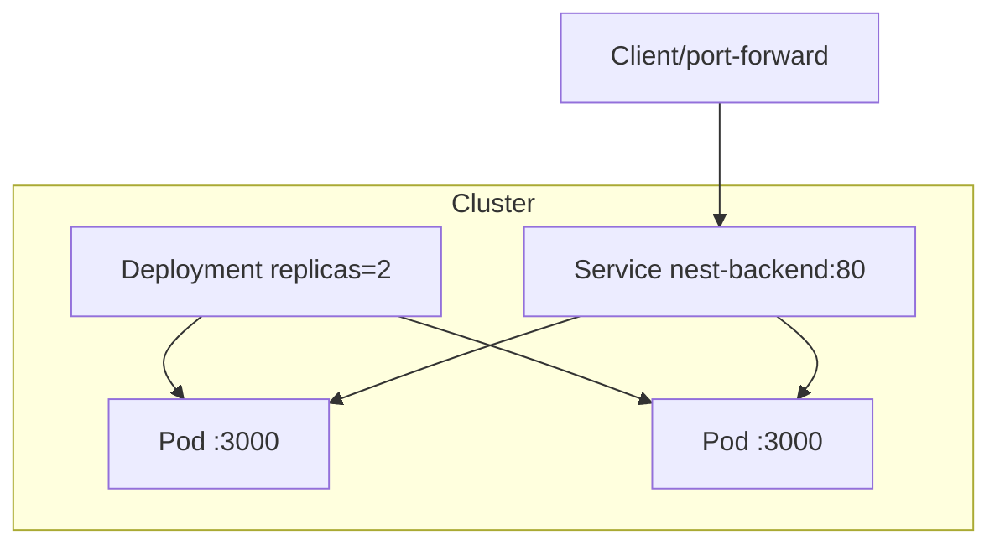
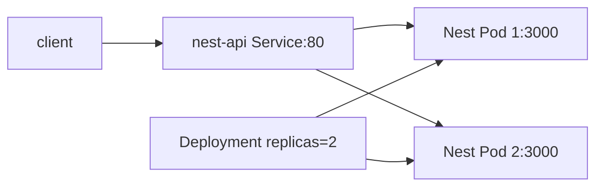

# 21. Deployment와 Service로 Nest.js 배포하기

- 영상: [Deployment와 Service로 Nest.js 배포하기](https://www.youtube.com/watch?v=vWEpYZl98j8)
- 플레이리스트: [JSCODE Kubernetes 입문/실전](https://www.youtube.com/playlist?list=PLtUgHNmvcs6pBvcX0ilCncJRgBHNs40vX)
- 문서 성격: 이 문서는 영상의 한국어 자막/스크립트를 확인한 뒤 재구성한 학습 문서다. 원문 스크립트를 복제하지 않고, 영상 흐름을 따라 개념 설명, 그림, 실습 코드를 보강했다.

## 이 챕터에서 얻어야 할 것

Nest.js 백엔드를 Deployment와 Service 조합으로 운영 형태에 가깝게 배포한다.

## 스크립트 기반 흐름 정리

- 영상은 Pod 단독 실습에서 벗어나 Deployment와 Service를 함께 사용한다.
- Deployment는 Nest.js 서버 Pod 복제와 복구를 맡고, Service는 안정적인 접근 경로를 제공한다.
- 실습은 매니페스트 적용, 리소스 확인, port-forward 또는 Service 경유 호출로 이어진다.

## 근원탐색: 왜 이 개념이 필요한가

실제 백엔드 운영은 “컨테이너 하나 실행”으로 끝나지 않는다. 복제, 장애 복구, 접근 주소가 필요하다. Deployment와 Service는 이 세 가지 요구를 최소 조합으로 만족한다.

## 구조 그림



## 핵심 개념 해설

통합 실습에서는 Deployment와 Service를 따로 이해한 뒤 하나의 배포 단위로 묶어 본다. Deployment가 애플리케이션 인스턴스를 관리하고 Service가 그 인스턴스 집합 앞에 안정적인 이름과 포트를 제공한다.

## 실습 매니페스트/코드

```yaml
apiVersion: apps/v1
kind: Deployment
metadata:
  name: nest-backend
spec:
  replicas: 2
  selector:
    matchLabels:
      app: nest-backend
  template:
    metadata:
      labels:
        app: nest-backend
    spec:
      containers:
        - name: app
          image: your-registry/nest-backend:latest
          ports:
            - containerPort: 3000
---
apiVersion: v1
kind: Service
metadata:
  name: nest-backend
spec:
  selector:
    app: nest-backend
  ports:
    - port: 80
      targetPort: 3000
```

## 따라칠 명령어

```bash
kubectl apply -f nest-backend.yaml
```

```bash
kubectl get deploy,svc,pods
```

```bash
kubectl get endpoints nest-backend
```

```bash
kubectl port-forward svc/nest-backend 8080:80
```

```bash
curl http://localhost:8080
```

## 확인 포인트

- Deployment와 Service를 한 파일에 ---로 나눠 작성할 수 있음을 확인한다.
- Service endpoint가 실제 Pod IP/port로 채워지는지 확인한다.

## 영상 기반 상세 학습 노트

Nest.js 서버도 운영 형태에서는 Deployment와 Service 조합으로 다룬다. Deployment는 복제와 복구를 맡고 Service는 안정적인 접근 지점을 만든다. label, selector, targetPort가 세 파일/객체를 잇는 핵심이다.

### 화면/구조를 문서로 옮기면



### 실습할 때 같이 확인할 명령

```bash
kubectl apply -f nest-deployment-service.yaml
kubectl get deploy,pod,svc,endpoints -l app=nest-api
kubectl port-forward svc/nest-api-service 8080:80
curl http://localhost:8080
```

### 이 장에서 꼭 남길 관찰

- 명령이 성공했는지보다 어떤 객체의 상태가 바뀌었는지 먼저 적는다.
- 실패가 나오면 `get -> describe -> logs/events` 순서로 원인을 좁힌다.
- 안정화된 설명은 나중에 `docs/concepts/`로 승격하고, 실제 실행 결과는 `docs/labs/`에 남긴다.

## 자주 헷갈리는 지점

- Service는 컨테이너를 직접 선택하지 않는다. label selector로 Pod를 고르고, Service port를 Pod의 targetPort로 전달한다.
- Deployment가 Pod를 직접 실행하는 것처럼 보이지만 실제로는 ReplicaSet과 Pod template을 통해 원하는 상태를 유지한다.
- 영상의 이미지 이름과 포트는 실습 코드에 맞게 바뀔 수 있다. 실제로 따라칠 때는 Dockerfile과 애플리케이션 listen port를 먼저 확인한다.

## 다음 문서로 승격할 내용

- `docs/concepts/service.md`에 selector, endpoint, port/targetPort, 안정적 접근 지점 개념을 정리한다.
