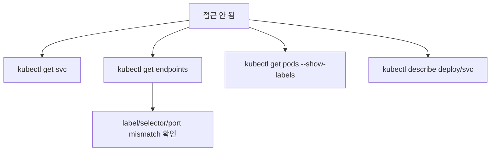
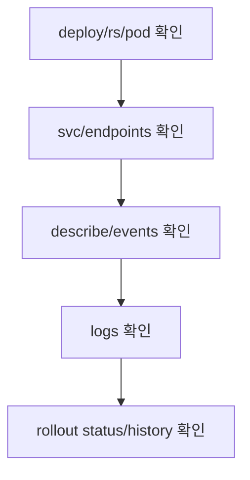

# 22. Deployment/Service 명령어 정리

- 영상: [Deployment/Service 명령어 정리](https://www.youtube.com/watch?v=3spPR3gAiAo)
- 플레이리스트: [JSCODE Kubernetes 입문/실전](https://www.youtube.com/playlist?list=PLtUgHNmvcs6pBvcX0ilCncJRgBHNs40vX)
- 문서 성격: 이 문서는 영상의 한국어 자막/스크립트를 확인한 뒤 재구성한 학습 문서다. 원문 스크립트를 복제하지 않고, 영상 흐름을 따라 개념 설명, 그림, 실습 코드를 보강했다.

## 이 챕터에서 얻어야 할 것

Deployment와 Service 파트에서 반복된 kubectl 명령을 사용 목적별로 정리한다.

## 스크립트 기반 흐름 정리

- 영상은 Deployment와 Service 실습에서 나온 명령어를 빠르게 정리한다.
- 리소스 조회 범위가 Pod에서 Deployment, ReplicaSet, Service, Endpoint로 확장된다.
- 운영에서는 여러 리소스를 함께 봐야 원인을 빠르게 찾을 수 있다.

## 근원탐색: 왜 이 개념이 필요한가

Kubernetes 문제는 리소스 하나만 보고 해결하기 어렵다. Service에 접근이 안 되면 Service, Endpoint, Pod label, Pod 상태를 함께 봐야 한다.

## 구조 그림



## 핵심 개념 해설

요약 챕터는 암기장이 아니라 리소스 관계를 압축해서 다시 확인하는 지점이다. 명령어를 사용할 때마다 “내가 지금 어떤 리소스의 어떤 상태를 확인하는가”를 함께 말할 수 있어야 한다.

## 실습 매니페스트/코드

```yaml
apiVersion: v1
kind: Service
metadata:
  name: command-summary
spec:
  selector:
    app: demo
  ports:
    - port: 80
      targetPort: 8080
```

## 따라칠 명령어

```bash
kubectl get deploy
```

```bash
kubectl get rs
```

```bash
kubectl get pods --show-labels
```

```bash
kubectl get svc
```

```bash
kubectl get endpoints
```

```bash
kubectl describe svc <service-name>
```

```bash
kubectl rollout status deploy/<deployment-name>
```

## 확인 포인트

- Service 문제를 볼 때 endpoints가 비어 있는지 먼저 확인한다.
- Deployment 문제를 볼 때 ReplicaSet과 Pod 상태까지 내려가 본다.

## 영상 기반 상세 학습 노트

Deployment와 Service 문제는 관계를 따라가며 확인한다. Deployment가 Pod를 만들었는지, Service가 Pod를 endpoint로 잡았는지, rollout이 완료됐는지, 앱 로그에 오류가 있는지를 순서대로 본다.

### 화면/구조를 문서로 옮기면



### 실습할 때 같이 확인할 명령

```bash
kubectl get deploy,rs,pod,svc
kubectl get endpoints <service-name>
kubectl describe deployment <name>
kubectl rollout status deployment/<name>
kubectl delete -f deployment-service.yaml
```

### 이 장에서 꼭 남길 관찰

- 명령이 성공했는지보다 어떤 객체의 상태가 바뀌었는지 먼저 적는다.
- 실패가 나오면 `get -> describe -> logs/events` 순서로 원인을 좁힌다.
- 안정화된 설명은 나중에 `docs/concepts/`로 승격하고, 실제 실행 결과는 `docs/labs/`에 남긴다.

## 자주 헷갈리는 지점

- Service는 컨테이너를 직접 선택하지 않는다. label selector로 Pod를 고르고, Service port를 Pod의 targetPort로 전달한다.
- Deployment가 Pod를 직접 실행하는 것처럼 보이지만 실제로는 ReplicaSet과 Pod template을 통해 원하는 상태를 유지한다.

## 다음 문서로 승격할 내용

- `docs/concepts/service.md`에 selector, endpoint, port/targetPort, 안정적 접근 지점 개념을 정리한다.
