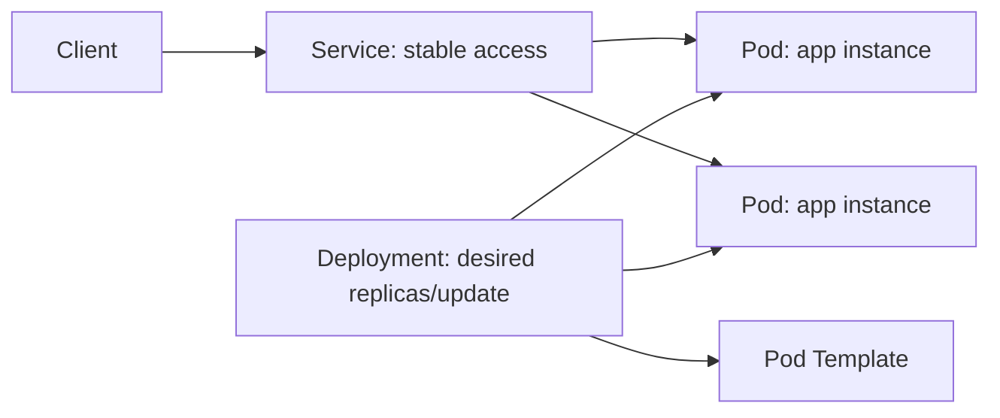
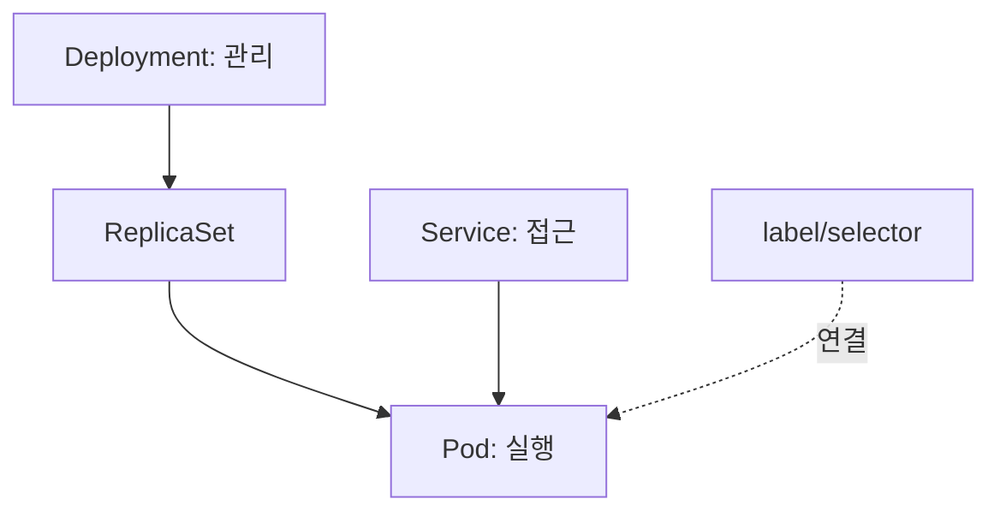

# 23. Pod, Deployment, Service 개념 종합

- 영상: [Pod, Deployment, Service 개념 종합](https://www.youtube.com/watch?v=wcwxFv1HNt8)
- 플레이리스트: [JSCODE Kubernetes 입문/실전](https://www.youtube.com/playlist?list=PLtUgHNmvcs6pBvcX0ilCncJRgBHNs40vX)
- 문서 성격: 이 문서는 영상의 한국어 자막/스크립트를 확인한 뒤 재구성한 학습 문서다. 원문 스크립트를 복제하지 않고, 영상 흐름을 따라 개념 설명, 그림, 실습 코드를 보강했다.

## 이 챕터에서 얻어야 할 것

Pod, Deployment, Service를 실행-관리-접근 문제로 연결해서 이해한다.

## 스크립트 기반 흐름 정리

- 영상은 지금까지 배운 세 리소스를 하나의 그림으로 정리한다.
- Pod는 실행 단위, Deployment는 원하는 개수와 업데이트 관리, Service는 안정적 접근 지점이다.
- 세 개념은 따로 외우는 것이 아니라 운영 문제를 나눈 결과로 봐야 한다.

## 근원탐색: 왜 이 개념이 필요한가

컨테이너 운영에는 실행, 복구/확장, 접근이라는 서로 다른 문제가 있다. Kubernetes는 이 문제를 하나의 거대한 설정으로 뭉치지 않고, 각 리소스가 역할을 나눠 해결하게 한다.

## 구조 그림



## 핵심 개념 해설

요약 챕터는 암기장이 아니라 리소스 관계를 압축해서 다시 확인하는 지점이다. 명령어를 사용할 때마다 “내가 지금 어떤 리소스의 어떤 상태를 확인하는가”를 함께 말할 수 있어야 한다.

## 실습 매니페스트/코드

```yaml
apiVersion: apps/v1
kind: Deployment
metadata:
  name: app
spec:
  replicas: 2
  selector:
    matchLabels:
      app: app
  template:
    metadata:
      labels:
        app: app
    spec:
      containers:
        - name: app
          image: your-registry/app:latest
          ports:
            - containerPort: 8080
---
apiVersion: v1
kind: Service
metadata:
  name: app
spec:
  selector:
    app: app
  ports:
    - port: 80
      targetPort: 8080
```

## 따라칠 명령어

```bash
kubectl apply -f app.yaml
```

```bash
kubectl get deploy,rs,pod,svc,endpoints
```

```bash
kubectl port-forward svc/app 8080:80
```

## 확인 포인트

- Pod, Deployment, Service를 각각 한 문장으로 설명한다.
- 트래픽이 사용자의 요청에서 컨테이너 프로세스까지 가는 경로를 그린다.

## 영상 기반 상세 학습 노트

세 리소스는 실행, 관리, 접근이라는 서로 다른 문제를 분리한다. Pod는 컨테이너 실행 환경, Deployment는 Pod 집합의 원하는 상태 유지, Service는 변하는 Pod 집합 앞의 안정적인 접근 지점이다.

### 화면/구조를 문서로 옮기면



### 실습할 때 같이 확인할 명령

```bash
kubectl apply -f app.yaml
kubectl get deploy,rs,pod,svc,endpoints
kubectl port-forward svc/app-service 8080:80
kubectl delete -f app.yaml
```

### 이 장에서 꼭 남길 관찰

- 명령이 성공했는지보다 어떤 객체의 상태가 바뀌었는지 먼저 적는다.
- 실패가 나오면 `get -> describe -> logs/events` 순서로 원인을 좁힌다.
- 안정화된 설명은 나중에 `docs/concepts/`로 승격하고, 실제 실행 결과는 `docs/labs/`에 남긴다.

## 자주 헷갈리는 지점

- Pod의 `containerPort`는 Docker의 `-p` 같은 포트포워딩 설정이 아니다. 실제로는 프로세스가 해당 포트를 listen해야 한다.
- Service는 컨테이너를 직접 선택하지 않는다. label selector로 Pod를 고르고, Service port를 Pod의 targetPort로 전달한다.
- Deployment가 Pod를 직접 실행하는 것처럼 보이지만 실제로는 ReplicaSet과 Pod template을 통해 원하는 상태를 유지한다.

## 다음 문서로 승격할 내용

- `docs/concepts/pod.md`에 Pod의 실행 단위, 네트워크 namespace, containerPort 오해를 정리한다.
