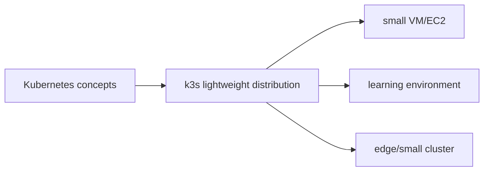
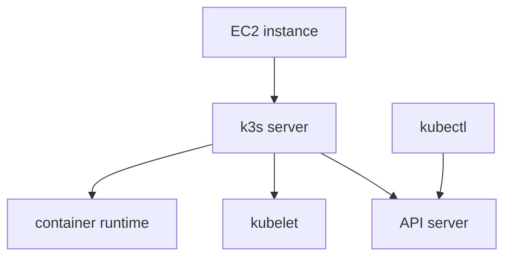

# 24. k3s란 무엇인가

- 영상: [k3s란 무엇인가](https://www.youtube.com/watch?v=1vbrnkaZlk4)
- 플레이리스트: [JSCODE Kubernetes 입문/실전](https://www.youtube.com/playlist?list=PLtUgHNmvcs6pBvcX0ilCncJRgBHNs40vX)
- 문서 성격: 이 문서는 영상의 한국어 자막/스크립트를 확인한 뒤 재구성한 학습 문서다. 원문 스크립트를 복제하지 않고, 영상 흐름을 따라 개념 설명, 그림, 실습 코드를 보강했다.

## 이 챕터에서 얻어야 할 것

k3s를 가벼운 Kubernetes 배포판으로 이해하고 학습/소규모 환경에서의 용도를 파악한다.

## 스크립트 기반 흐름 정리

- 영상은 k3s를 쿠버네티스를 더 가볍게 설치하고 사용할 수 있는 배포판으로 소개한다.
- 로컬 실습에서 실제 서버 실습으로 넘어가는 다리 역할을 한다.
- 표준 Kubernetes 개념은 유지하면서 설치와 운영 부담을 줄이는 데 초점을 둔다.

## 근원탐색: 왜 이 개념이 필요한가

표준 Kubernetes 클러스터 구성은 입문자나 작은 서버에는 무겁다. k3s는 학습, edge, 소규모 서버 환경에서 Kubernetes API와 핵심 기능을 더 쉽게 경험하게 해준다.

## 구조 그림




## 실습 매니페스트/코드

- 이 챕터는 개념/설치 흐름 중심이라 고정 YAML 예시는 없다. 영상 시청 중 실제 환경 값은 별도 lab 문서에 기록한다.

## 따라칠 명령어

```bash
curl -sfL https://get.k3s.io | sh -
```

```bash
sudo k3s kubectl get nodes
```

```bash
sudo systemctl status k3s
```

## 확인 포인트

- k3s가 Kubernetes와 별개 기술이 아니라 가벼운 배포판이라는 점을 설명한다.
- 실습 환경에서는 설치 편의성과 운영 단순성이 중요하다는 점을 기억한다.

## 영상 기반 상세 학습 노트

k3s는 Kubernetes와 다른 API가 아니라 가벼운 Kubernetes 배포판이다. 복잡한 클러스터 설치 부담을 줄여 EC2 한 대에서도 Pod, Deployment, Service 실습을 실제 서버 네트워크와 함께 해볼 수 있게 한다.

### 화면/구조를 문서로 옮기면



### 실습할 때 같이 확인할 명령

```bash
curl -sfL https://get.k3s.io | sh -
sudo k3s kubectl get nodes
sudo k3s kubectl get pods -A
```

### 이 장에서 꼭 남길 관찰

- 명령이 성공했는지보다 어떤 객체의 상태가 바뀌었는지 먼저 적는다.
- 실패가 나오면 `get -> describe -> logs/events` 순서로 원인을 좁힌다.
- 안정화된 설명은 나중에 `docs/concepts/`로 승격하고, 실제 실행 결과는 `docs/labs/`에 남긴다.

## 자주 헷갈리는 지점

- k3s는 Kubernetes와 다른 API가 아니라 가벼운 Kubernetes 배포판이다.

## 다음 문서로 승격할 내용

- `docs/concepts/k3s.md`에 경량 Kubernetes 배포판으로서의 k3s와 실습 환경 구성법을 정리한다.
