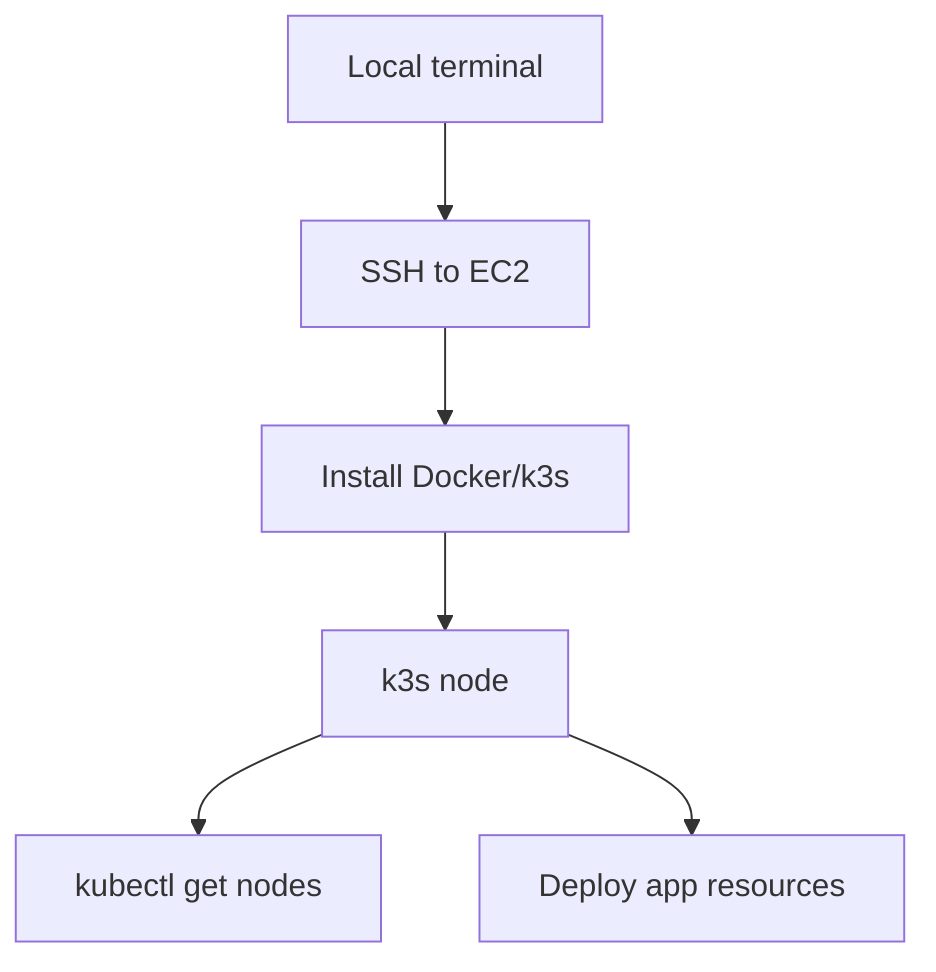
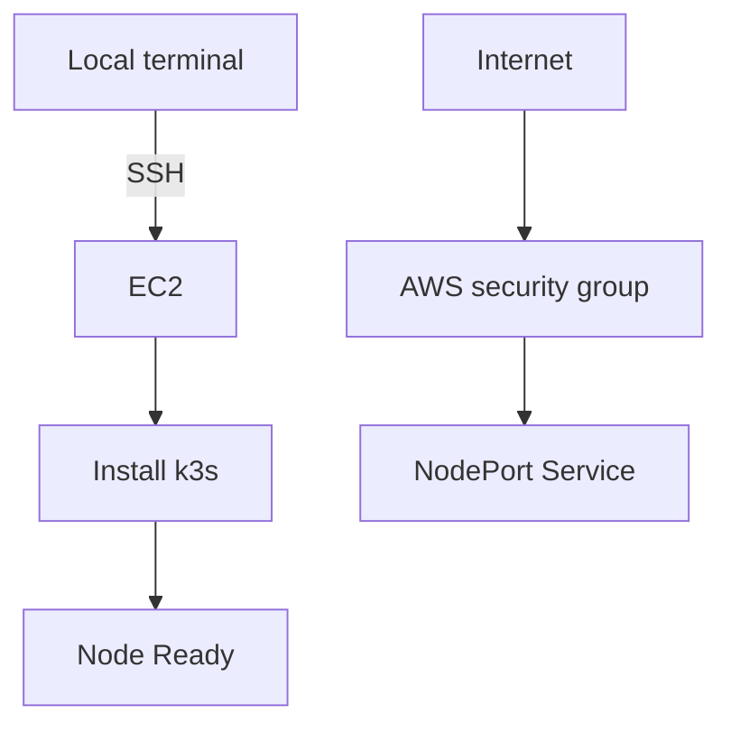

# 25. EC2에 Docker와 k3s 설치하기

- 영상: [EC2에 Docker와 k3s 설치하기](https://www.youtube.com/watch?v=un4KTzueSl8)
- 플레이리스트: [JSCODE Kubernetes 입문/실전](https://www.youtube.com/playlist?list=PLtUgHNmvcs6pBvcX0ilCncJRgBHNs40vX)
- 문서 성격: 이 문서는 영상의 한국어 자막/스크립트를 확인한 뒤 재구성한 학습 문서다. 원문 스크립트를 복제하지 않고, 영상 흐름을 따라 개념 설명, 그림, 실습 코드를 보강했다.

## 이 챕터에서 얻어야 할 것

원격 서버에 k3s 기반 Kubernetes 실습 환경을 준비한다.

## 스크립트 기반 흐름 정리

- 영상은 EC2 같은 원격 서버에 접속해 Docker/k3s 실습 환경을 구성하는 흐름을 다룬다.
- 로컬 PC에서만 실습하던 내용을 실제 네트워크를 가진 서버로 확장한다.
- 설치 후 노드 상태와 kubectl 접근을 확인한다.

## 근원탐색: 왜 이 개념이 필요한가

Kubernetes를 로컬에서만 이해하면 외부 접속, 보안 그룹, 서버 네트워크, 포트 노출의 감각이 약하다. EC2와 k3s 조합은 작지만 실제 운영 환경에 가까운 실습장을 만든다.

## 구조 그림



## 핵심 개념 해설

원격 서버 실습은 Kubernetes 리소스만으로 끝나지 않는다. 클라우드 보안 그룹, 서버 방화벽, NodePort/LoadBalancer/Ingress 같은 외부 노출 계층도 함께 확인해야 한다.

## 실습 매니페스트/코드

- 이 챕터는 개념/설치 흐름 중심이라 고정 YAML 예시는 없다. 영상 시청 중 실제 환경 값은 별도 lab 문서에 기록한다.

## 따라칠 명령어

```bash
ssh ubuntu@<ec2-public-ip>
```

```bash
curl -sfL https://get.k3s.io | sh -
```

```bash
sudo k3s kubectl get nodes
```

```bash
sudo k3s kubectl get pods -A
```

## 확인 포인트

- EC2 보안 그룹에서 필요한 포트가 열려 있는지 확인한다.
- k3s의 kubectl 경로와 kubeconfig 위치를 확인한다.

## 영상 기반 상세 학습 노트

원격 서버 실습에서는 Kubernetes 리소스뿐 아니라 SSH, 보안 그룹, 서버 네트워크가 같이 등장한다. k3s 설치 후에는 Node Ready, system Pod 상태, 외부 접근 포트 허용 여부를 함께 확인해야 한다.

### 화면/구조를 문서로 옮기면



### 실습할 때 같이 확인할 명령

```bash
ssh ubuntu@<ec2-public-ip>
curl -sfL https://get.k3s.io | sh -
sudo systemctl status k3s --no-pager
sudo k3s kubectl get nodes -o wide
sudo k3s kubectl get pods -A
```

### 이 장에서 꼭 남길 관찰

- 명령이 성공했는지보다 어떤 객체의 상태가 바뀌었는지 먼저 적는다.
- 실패가 나오면 `get -> describe -> logs/events` 순서로 원인을 좁힌다.
- 안정화된 설명은 나중에 `docs/concepts/`로 승격하고, 실제 실행 결과는 `docs/labs/`에 남긴다.

## 자주 헷갈리는 지점

- k3s는 Kubernetes와 다른 API가 아니라 가벼운 Kubernetes 배포판이다.
- 영상의 이미지 이름과 포트는 실습 코드에 맞게 바뀔 수 있다. 실제로 따라칠 때는 Dockerfile과 애플리케이션 listen port를 먼저 확인한다.

## 다음 문서로 승격할 내용

- `docs/concepts/k3s.md`에 경량 Kubernetes 배포판으로서의 k3s와 실습 환경 구성법을 정리한다.
