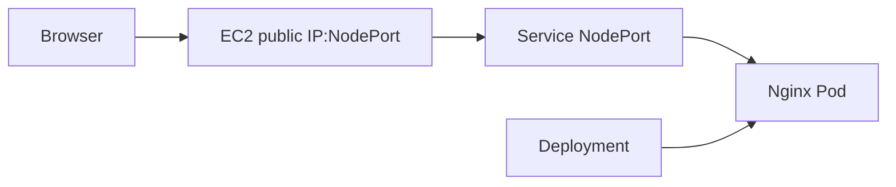
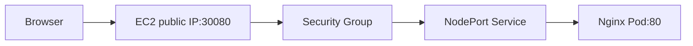

# 26. k3s에서 Nginx 웹 서버 배포하기

- 영상: [k3s에서 Nginx 웹 서버 배포하기](https://www.youtube.com/watch?v=me3Q6CsOjyQ)
- 플레이리스트: [JSCODE Kubernetes 입문/실전](https://www.youtube.com/playlist?list=PLtUgHNmvcs6pBvcX0ilCncJRgBHNs40vX)
- 문서 성격: 이 문서는 영상의 한국어 자막/스크립트를 확인한 뒤 재구성한 학습 문서다. 원문 스크립트를 복제하지 않고, 영상 흐름을 따라 개념 설명, 그림, 실습 코드를 보강했다.

## 이 챕터에서 얻어야 할 것

k3s 클러스터에서 Deployment와 Service로 Nginx 웹 서버를 배포한다.

## 스크립트 기반 흐름 정리

- 영상은 k3s 환경에서 Nginx Deployment와 Service를 적용한다.
- 앞에서 배운 Deployment/Service 패턴이 원격 서버에서도 그대로 사용된다.
- 브라우저나 curl로 실제 서버 접근을 확인하는 단계까지 이어진다.

## 근원탐색: 왜 이 개념이 필요한가

Kubernetes API 리소스는 로컬 실습과 원격 k3s에서도 같은 방식으로 동작한다. 차이는 클러스터가 실제 네트워크에 연결되어 있고, 외부 접근을 위해 Service type, NodePort, 보안 그룹 같은 계층을 고려해야 한다는 점이다.

## 구조 그림



## 핵심 개념 해설

원격 서버 실습은 Kubernetes 리소스만으로 끝나지 않는다. 클라우드 보안 그룹, 서버 방화벽, NodePort/LoadBalancer/Ingress 같은 외부 노출 계층도 함께 확인해야 한다.

## 실습 매니페스트/코드

```yaml
apiVersion: apps/v1
kind: Deployment
metadata:
  name: nginx-web
spec:
  replicas: 1
  selector:
    matchLabels:
      app: nginx-web
  template:
    metadata:
      labels:
        app: nginx-web
    spec:
      containers:
        - name: nginx
          image: nginx
          ports:
            - containerPort: 80
---
apiVersion: v1
kind: Service
metadata:
  name: nginx-web
spec:
  type: NodePort
  selector:
    app: nginx-web
  ports:
    - port: 80
      targetPort: 80
      nodePort: 30080
```

## 따라칠 명령어

```bash
sudo k3s kubectl apply -f nginx-web.yaml
```

```bash
sudo k3s kubectl get deploy,svc,pods
```

```bash
curl http://localhost:30080
```

```bash
curl http://<ec2-public-ip>:30080
```

## 확인 포인트

- NodePort와 ClusterIP의 차이를 확인한다.
- 외부 접속이 안 되면 Kubernetes 리소스뿐 아니라 EC2 보안 그룹도 확인한다.

## 영상 기반 상세 학습 노트

원격 k3s에서 Nginx를 외부에 노출하려면 Deployment로 Pod를 만들고 NodePort Service로 EC2 노드 포트를 열어야 한다. Kubernetes 객체가 정상이어도 AWS 보안 그룹이 닫혀 있으면 외부 브라우저 접근은 실패한다.

### 화면/구조를 문서로 옮기면



### 실습할 때 같이 확인할 명령

```bash
sudo k3s kubectl apply -f nginx-nodeport.yaml
sudo k3s kubectl get deploy,pod,svc,endpoints
curl http://localhost:30080
curl http://<ec2-public-ip>:30080
```

### 이 장에서 꼭 남길 관찰

- 명령이 성공했는지보다 어떤 객체의 상태가 바뀌었는지 먼저 적는다.
- 실패가 나오면 `get -> describe -> logs/events` 순서로 원인을 좁힌다.
- 안정화된 설명은 나중에 `docs/concepts/`로 승격하고, 실제 실행 결과는 `docs/labs/`에 남긴다.

## 자주 헷갈리는 지점

- k3s는 Kubernetes와 다른 API가 아니라 가벼운 Kubernetes 배포판이다.
- 영상의 이미지 이름과 포트는 실습 코드에 맞게 바뀔 수 있다. 실제로 따라칠 때는 Dockerfile과 애플리케이션 listen port를 먼저 확인한다.

## 다음 문서로 승격할 내용

- `docs/concepts/k3s.md`에 경량 Kubernetes 배포판으로서의 k3s와 실습 환경 구성법을 정리한다.
