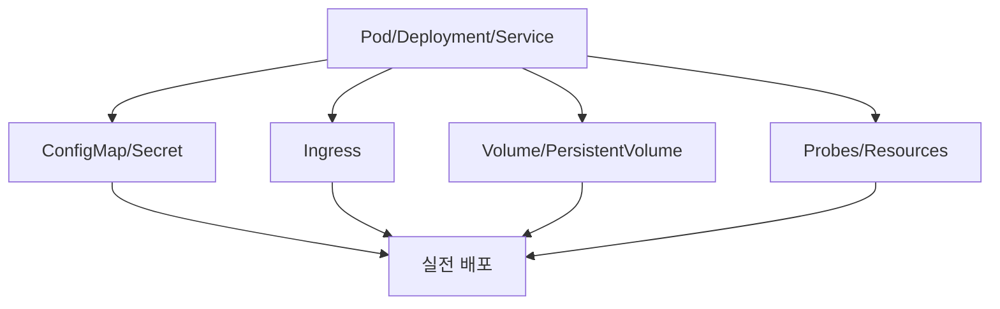

# 27. 쿠버네티스를 빠르게 배우는 방법

- 영상: [쿠버네티스를 빠르게 배우는 방법](https://www.youtube.com/watch?v=nkXgO4I1sso)
- 플레이리스트: [JSCODE Kubernetes 입문/실전](https://www.youtube.com/playlist?list=PLtUgHNmvcs6pBvcX0ilCncJRgBHNs40vX)
- 문서 성격: 이 문서는 영상의 한국어 자막/스크립트를 확인한 뒤 재구성한 학습 문서다. 원문 스크립트를 복제하지 않고, 영상 흐름을 따라 개념 설명, 그림, 실습 코드를 보강했다.

## 이 챕터에서 얻어야 할 것

입문 이후 학습을 어떻게 확장할지 정리한다.

## 스크립트 기반 흐름 정리

- 영상은 쿠버네티스를 빠르게 배우려면 핵심 개념을 직접 실습하며 연결해야 한다고 강조한다.
- Pod, Deployment, Service를 먼저 단단히 잡고 이후 Ingress, ConfigMap, Secret, Volume 등으로 확장한다.
- 명령어를 외우는 것보다 어떤 문제를 해결하는 추상화인지 이해하는 것이 중요하다.

## 근원탐색: 왜 이 개념이 필요한가

쿠버네티스는 리소스 종류가 많아 보이지만 대부분은 운영 문제를 나눠 해결하기 위해 등장했다. 근원탐색 방식으로 “어떤 문제를 해결하기 위해 이 리소스가 생겼는가”를 묻는 것이 빠른 학습 경로다.

## 구조 그림



## 핵심 개념 해설

학습 전략 챕터는 다음 단계의 기준을 세우는 데 목적이 있다. 새 리소스를 볼 때 이름을 외우기보다 “무슨 운영 문제 때문에 생겼는가”를 먼저 묻는 습관을 유지한다.

## 실습 매니페스트/코드

- 이 챕터는 개념/설치 흐름 중심이라 고정 YAML 예시는 없다. 영상 시청 중 실제 환경 값은 별도 lab 문서에 기록한다.

## 따라칠 명령어

```bash
kubectl explain pod
```

```bash
kubectl explain deployment.spec
```

```bash
kubectl explain service.spec
```

```bash
kubectl api-resources
```

## 확인 포인트

- 새 리소스를 볼 때 “왜 필요한가”를 먼저 묻는다.
- 실습 결과는 docs/labs에, 안정화된 개념은 docs/concepts에 승격한다.

## 영상 기반 상세 학습 노트

쿠버네티스를 빠르게 배우는 방법은 많은 개념을 한 번에 읽는 것이 아니라 배포하고, 깨뜨리고, 관찰하고, 문서화하는 루프를 짧게 반복하는 것이다. Pod/Deployment/Service를 여러 앱으로 반복한 뒤 ConfigMap, Secret, Ingress, Volume, Namespace로 넓혀간다.

### 화면/구조를 문서로 옮기면


### 실습할 때 같이 확인할 명령

```bash
kubectl get all
kubectl explain pod.spec.containers
kubectl explain deployment.spec.strategy
kubectl explain service.spec.ports
kubectl api-resources
```

### 이 장에서 꼭 남길 관찰

- 명령이 성공했는지보다 어떤 객체의 상태가 바뀌었는지 먼저 적는다.
- 실패가 나오면 `get -> describe -> logs/events` 순서로 원인을 좁힌다.
- 안정화된 설명은 나중에 `docs/concepts/`로 승격하고, 실제 실행 결과는 `docs/labs/`에 남긴다.

## 자주 헷갈리는 지점

- 리소스 이름보다 이 리소스가 해결하는 운영 문제를 먼저 기억한다.

## 다음 문서로 승격할 내용

- 실습 결과는 `docs/labs/`에 따로 남기고, 반복해서 재사용할 개념은 `docs/concepts/`로 승격한다.
